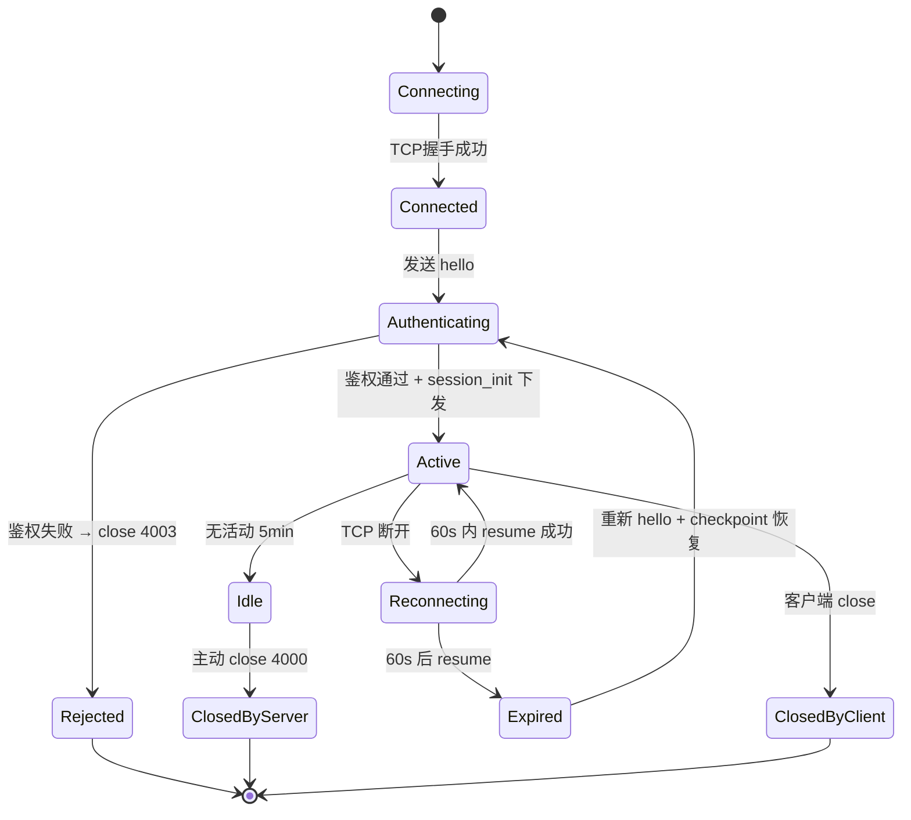
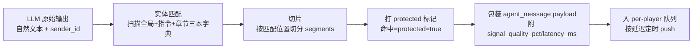
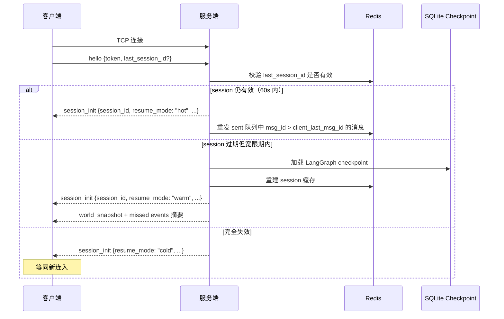

# WebSocket 接口定义 v1.1

> **文档版本**：v1.1（v1.0 + 章节字典补充）  
> **作者**：云逸-架构技术总监  
> **日期**：2026-08-02  
> **面向对象**：千机-引擎实现工程师（前端对接）、锐锋-核心开发工程师（后端实现）  
> **依赖文档**：《技术架构设计方案 v2.0》§3.4 数据流架构、《前端视觉规范_CSS参数表.md》§2 信号四档遮罩

---

## 0. 设计目标

| 目标 | 说明 |
|------|------|
| **双向实时** | 玩家输入与 NPC 推送共用一条连接，无需维护双通道 |
| **延迟模拟友好** | 后端按信号规则 hold 住消息到点 push，天然契合"远程指挥"沉浸感 |
| **断线无损** | 短断线 Redis session 复用，长断线 SQLite checkpoint 恢复 LangGraph 状态 |
| **遮罩受控** | 关键剧情信息（NPC 名、指令响应、任务关键词）受保护，前端只对未保护段按四档渲染 |
| **可降级** | 服务端不可用时客户端切 HTTP 轮询兜底 |

---

## 1. 连接生命周期

### 1.1 连接地址与鉴权

- **URL**：`ws://{host}/ws`（不带 player_id 与 token，避免 URL/日志泄露）
- **鉴权方式**：建连后由客户端发送首条 `hello` 消息携带 JWT，服务端校验通过才正式入会话

### 1.2 生命周期状态机



### 1.3 关键超时参数

| 参数 | 值 | 说明 |
|------|----|----|
| 心跳间隔 | 30s | 客户端发 `ping`，服务端回 `pong` |
| 心跳超时 | 90s | 服务端 90s 未收到任何客户端帧 → 主动 close |
| 空闲断开 | 5min | Active 状态无任何输入/推送 → 服务端 close 4000 |
| 短断线 TTL | 60s | TCP 断开后 60s 内 `resume` 可复用 session |
| 长断线宽限 | 5min | 超过 60s 后仍可 resume，但需从 SQLite checkpoint 恢复 |
| per-player 队列尾缓存 | 5min | 已 push 消息在 Redis 保留 5min，供快速重发 |

---

## 2. 消息格式总览

### 2.1 统一信封（Envelope）

所有 C→S 与 S→C 消息使用同一 JSON 信封：

```json
{
  "msg_id": "uuid_v4_string",
  "type": "message_type_enum",
  "ts_tick": 12345,
  "payload": { }
}
```

| 字段 | 类型 | 说明 |
|------|------|------|
| `msg_id` | string (UUIDv4) | 消息唯一 ID，用于幂等与重发判定 |
| `type` | enum | 消息类型，见 §3 |
| `ts_tick` | int | 服务端 game tick（全局逻辑时钟，单调递增） |
| `payload` | object | 类型相关的具体数据 |

### 2.2 字段命名约定

- **wire format 用 snake_case**（Python 后端友好，前端做一次映射即可）
- 数值字段带单位后缀（如 `signal_quality_pct`、`latency_ms`）
- 时间戳一律 `ts_tick`（游戏内 tick），物理时间用 `wall_ts`（Unix 毫秒）

---

## 3. 消息类型枚举

### 3.1 C→S（客户端发）

| type | 触发场景 | payload 关键字段 |
|------|----------|------------------|
| `hello` | 建连后首条 | `token`, `client_version`, `last_session_id?` |
| `resume` | 短断线重连 | `session_id`, `last_msg_id` |
| `ping` | 心跳 | 空 |
| `player_input` | 玩家自然语言输入 | `text`, `target_agent_id?` |
| `command` | 终端系统命令 | `raw`, `args[]` |
| `ack` | 收到推送确认（可选） | `acked_msg_id` |

### 3.2 S→C（服务端发）

| type | 触发场景 | payload 关键字段 |
|------|----------|------------------|
| `session_init` | hello 鉴权通过后下发 | `session_id`, `player_state`, `world_snapshot`, `signal_quality_pct` |
| `pong` | 心跳响应 | `server_tick` |
| `agent_message` | NPC 推送消息（核心类型） | `sender_id`, `segments[]`, `signal_quality_pct`, `latency_ms`, `context_summary?` |
| `command_response` | 终端命令执行结果 | `output_segments[]`, `data?` |
| `state_update` | 资源/Agent 状态变化 | `path`, `old`, `new` |
| `system_event` | 事件触发（日志/告警） | `event_id`, `category`, `severity`, `text` |
| `alert` | 高优先级告警（弹窗/红框） | `level`, `code`, `text` |
| `error` | 错误响应 | `code`, `message` |
| `ack` | 收到客户端消息确认 | `acked_msg_id` |

---

## 4. `agent_message` 详解（核心消息）

### 4.1 payload 结构

```json
{
  "sender_id": "chen_hao",
  "sender_label": "CMDR",
  "segments": [
    {"text": "[CMDR]> ", "protected": true, "tag": "speaker_label"},
    {"text": "信号有点弱……外面的", "protected": false, "tag": "narration"},
    {"text": "气闸舱", "protected": true, "tag": "mission_keyword"},
    {"text": "温度还在下降", "protected": false, "tag": "narration"}
  ],
  "signal_quality_pct": 45,
  "latency_ms": 2300,
  "emotion_hint": {"stress": 0.55, "morale": 0.50},
  "context_summary": {
    "history_count": 12,
    "k_limit": 6,
    "compressed_count": 4,
    "mode": "deliberate"
  }
}
```

### 4.1.1 context_summary 字段（可选）

| 字段 | 类型 | 说明 |
|------|------|------|
| `history_count` | int | 当前上下文消息数 |
| `k_limit` | int | 当前决策模式窗口上限（deliberate=6, deep=10） |
| `compressed_count` | int | 已压缩的旧消息数 |
| `mode` | enum | 当前决策模式：`reflexive` / `deliberate` / `deep` |

> 前端可用 `history_count / k_limit` 比值渲染记忆负载指示器。该字段为可选，非所有消息类型都携带。

### 4.2 segments schema

| 字段 | 类型 | 必填 | 说明 |
|------|------|------|------|
| `text` | string | 是 | 文本片段 |
| `protected` | bool | 是 | true=永不遮罩；false=按 signal_quality_pct 走四档渲染 |
| `tag` | enum | 否 | 诊断用，便于日志与调试，前端可忽略。取值见 §4.3 |

> ⚠️ 与幻影《前端视觉规范_CSS参数表》§2.4 的 `Segment` 接口完全兼容；`tag` 为本协议新增的可选字段，前端实现时按需读取即可。

### 4.3 segment.tag 取值

| tag | 含义 | 默认 protected |
|-----|------|-----------------|
| `speaker_label` | 发言者前缀（如 `[CMDR]> `） | true |
| `npc_name` | NPC 名字（陈昊、索菲亚等） | true |
| `command_response` | 终端命令输出值（数字/路径） | true |
| `mission_keyword` | 任务关键实体（设施名、目标名、关键物品） | true |
| `speech` | 角色对白正文 | false |
| `narration` | 旁白/环境描写 | false |
| `action` | 动作描述（"维克托拧紧了阀门"） | false |
| `smalltalk` | 闲聊 | false |

> protected 默认值仅作参考；最终以 segment 实际 `protected` 字段为准。

### 4.4 渲染规则映射（与幻影四档对齐）

| 信号质量 | 档位 | 未保护段渲染 | 受保护段渲染 |
|---------|------|--------------|--------------|
| 80-100% | L1 正常 | 原样 | 原样 |
| 50-79% | L2 轻度 | ~15% 字符替换为 `▓`，opacity 0.85，0.3s 抖动 | 原样 |
| 20-49% | L3 重度 | ~45% 字符替换为 `▒▓`，opacity 0.6，0.2s 抖动 + 闪烁 | 原样 |
| 0-19% | L4 极差 | ~75% 字符替换为 `▒▓█`，opacity 0.35，0.15s 抖动 + 闪烁 | 原样 |

---

## 5. 受保护字典与后端后处理

### 5.1 字典层级与维护责任

字典拆为**两层**，按作用范围分离，避免全局字典膨胀，也防临时线索遗漏：

| 层级 | 内容 | 维护方 | 加载策略 |
|------|------|--------|----------|
| **全局字典** | 贯穿全流程的核心实体：NPC 名（含中英文/绰号）、地标、核心道具、AI 系统名（信使/雅典娜） | 蔚蓝定义 + 架构层（云逸）初始化注入 | 游戏启动时全量加载，仅在剧本/角色变更时替换 |
| **指令词表** | 终端命令动词（`ls`/`status`/`talk` 等） | 蔚蓝定义 + 锐锋落地 | 静态，新增命令时追加 |
| **章节字典** | 当前章节才出现的临时线索词（如"染血的怀表"、"第三气闸舱日志"） | 蔚蓝按章节维护，随剧情推进动态更新 | 章节进入时加载、退出时卸载，按 sol 刷新 |

> 章节字典通过事件系统在章节进入/退出事件中调用 `dict.load_chapter(chapter_id)` / `dict.unload_chapter(chapter_id)` 增删。

### 5.2 后处理流水线



### 5.3 实体匹配算法（建议）

- 使用 **Aho-Corasick 多模式匹配**（pyahocorasick 库），把三本字典合并建自动机
- 单次扫描复杂度 O(n + m)，n=文本长度，m=匹配数
- 匹配命中区间 → 切分为 protected 段；区间外文本 → 切分为未保护段
- 重叠区间按"最长匹配"原则合并
- 同一段文本不会同时被标记为多个 tag；冲突时优先级：`mission_keyword`（章节字典命中） > `npc_name`（全局字典命中） > `command_response`（指令词表命中） > `speaker_label` > 其他

### 5.4 字典热更新

- **章节字典**：章节进入/退出事件触发增量加载/卸载，重建自动机（<10ms，可忽略）
- **全局字典**：仅在剧本变更或角色增减时全量替换（极少触发）
- **指令词表**：基本静态，新增命令时追加
- 后处理模块订阅字典变更事件，自动重建自动机，无需重启服务

### 5.5 字典 schema 示例

```yaml
# 全局字典 global_dict.yaml
npc_names:
  - {display: "陈昊", aliases: ["Dr. Chen Hao", "指挥官", "陈指挥"]}
  - {display: "索菲亚·拉米雷斯", aliases: ["索菲亚", "Sofia", "Sofia Ramirez"]}
  - {display: "维克托·伊万诺夫", aliases: ["维克托", "Viktor", "Viktor Ivanov"]}
  - {display: "艾莎·汗", aliases: ["艾莎", "Aisha", "Aisha Khan"]}
  - {display: "马库斯·韦伯", aliases: ["马库斯", "Marcus", "Marcus Weber"]}
  - {display: "林若曦", aliases: ["林若曦", "Ruoxi", "Lin Ruoxi"]}
ai_systems:
  - {display: "信使", aliases: ["Courier", "COURIER"]}
  - {display: "雅典娜", aliases: ["Athena", "ATHENA"]}
landmarks:
  - {display: "赫拉克勒斯-7号基地", aliases: ["基地", "赫拉克勒斯", "Hercules-7"]}
core_items:
  - {display: "信号中继", aliases: ["中继器", "relay"]}
```

```yaml
# 章节字典 chapter_03.yaml（章节3：第三气闸舱异常）
chapter_id: "ch03_airlock_anomaly"
keywords:
  - {display: "第三气闸舱", aliases: ["气闸舱3", "Airlock-3"]}
  - {display: "染血的怀表", aliases: ["怀表", "bloody watch"]}
  - {display: "14号日志", aliases: ["Log-14", "日志14号"]}
ttl: null  # 章节卸载时自动清除
```

---

## 6. per-player 消息队列

### 6.1 队列结构

| 实现 | 用途 |
|------|------|
| Redis List `mq:player:{player_id}` | 持久化待 push 消息（按 push 时刻排序） |
| Redis Sorted Set `mq:player:{player_id}:sent` | 已 push 消息缓存（score=push_ts），5min TTL，供重发 |
| asyncio.Queue（进程内） | 实时调度，避免每次都查 Redis |

### 6.2 调度规则

1. Agent 生成消息 → 计算延迟 `latency_ms = base_latency + signal_penalty`
   - `base_latency`：500ms（基础往返）
   - `signal_penalty`：`(100 - signal_quality_pct) * 50ms`，信号越差延迟越大
2. 入队时记录 `push_at = now + latency_ms`
3. Push worker 按 `push_at` 定时触发，单 player 并发上限 4（防刷屏）
4. 玩家 `player_input`/`command` 不排队，走快速通道立即处理

### 6.3 队列与 L4 日志分流

- `agent_message` → L3 对话流区域
- `system_event` → L4 事件日志区域（不参与对话上下文）
- `state_update` → L1 状态条 + 内部状态缓存
- `alert` → 弹窗 + L4 红框告警

---

## 7. 断线重连协议

### 7.1 流程



### 7.2 客户端职责

- 本地持久化 `last_msg_id`（localStorage 即可），重连时一并发送
- 收到 `session_init.resume_mode = "hot"` 时，对服务端重发的消息做去重（按 msg_id）
- `resume_mode = "warm"` 时，先消费 world_snapshot 重建本地状态，再处理 missed events

### 7.3 服务端职责

- Redis 维护 `session:{session_id}` → `{player_id, established_at, last_active_at, ws_handle}`
- 断线检测后启动 60s TTL；TTL 内 `resume` 命中即复用，TTL 过期转 warm 模式
- warm 模式从 SQLite 加载 LangGraph checkpoint（LangGraph 原生 SqliteSaver 支持）

---

## 8. 错误码与异常处理

### 8.1 WebSocket Close Code

| Code | 含义 | 客户端动作 |
|------|------|-----------|
| 4000 | 服务端空闲超时 | 等同正常断开，可立即 resume |
| 4001 | 消息格式错误（schema 不符） | 修正 payload 后重连 |
| 4003 | 鉴权失败 | 重新获取 token |
| 4004 | 限流触发 | 退避后重连 |
| 4029 | 版本不兼容 | 升级客户端 |
| 4500 | 服务端内部错误 | 退避重连，必要时切兜底模式 |

### 8.2 业务错误（payload 内 `error` 消息）

| code | 触发场景 | 处理建议 |
|------|----------|---------|
| `E_AGENT_BUSY` | 目标 Agent 正在深思决策，无法立即响应 | 前端提示"正在思考…" |
| `E_AGENT_UNREACHABLE` | 信号质量过低，Agent 不可达 | 前端提示"信号丢失" |
| `E_COMMAND_NOT_FOUND` | 未知终端命令 | 终端直接输出 `command not found` |
| `E_RATE_LIMIT` | 玩家输入过快被限流 | 终端提示"信噪过大，请稍候" |
| `E_INTERNAL` | 服务端异常 | 日志告警 + 客户端兜底 |

### 8.3 客户端兜底（HTTP 轮询）

- 服务端不可用超过 30s → 客户端切 HTTP 轮询模式
- 轮询端点 `GET /api/poll?session_id=xxx&since=msg_id`，返回新消息列表
- 轮询间隔 2s（避免破坏沉浸感，前端可显示"信号不稳"提示）
- WebSocket 恢复后切回长连接，丢弃轮询期间产生的重复 msg_id

---

## 9. 待办与下一步

| 待办 | 责任方 | 备注 |
|------|--------|------|
| 实现 WebSocket 网关 + per-player 队列 | 锐锋 | 走 FastAPI + Redis List |
| 实现 segments 后处理模块 | 锐锋 | 依赖 Agent 名册、指令词表、任务关键词字典 |
| 实现 SignalRenderer 前端组件 | 千机 | 已对齐幻影 §2.4 接口 |
| mock segments 数据先行 | 千机 | 用本文 §4.1 示例作 mock |
| LangGraph SqliteSaver 接入 | 锐锋 | warm 模式恢复用 |
| 章节字典章节进入/退出加载接口 | 蔚蓝定义 + 锐锋实现 | 事件触发时调用 `dict.load_chapter(chapter_id)` / `dict.unload_chapter(chapter_id)` |

---

## 10. 变更记录

| 版本 | 日期 | 变更 |
|------|------|------|
| v1.0 | 2026-08-02 | 首版交付，覆盖连接生命周期、消息信封、segments schema、后处理流水线、断线重连、错误码 |
| v1.1 | 2026-08-02 | §5 字典结构拆为「全局字典 + 指令词表 + 章节字典」三层，章节字典支持章节级覆盖；补充 §5.5 字典 schema 示例（含官方 NPC 名册与章节临时线索） |

---

*对接过程中如有字段调整需求，请在群里 @云逸-架构技术总监。*
