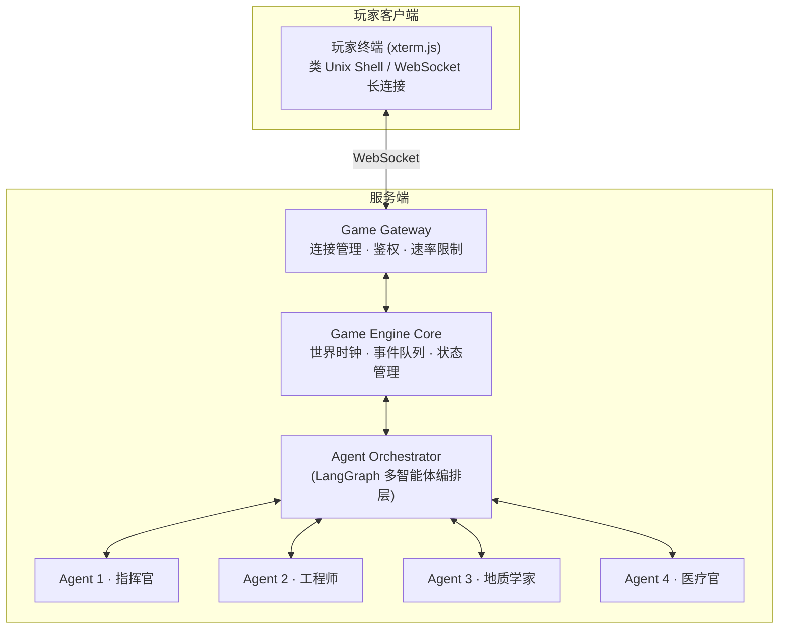
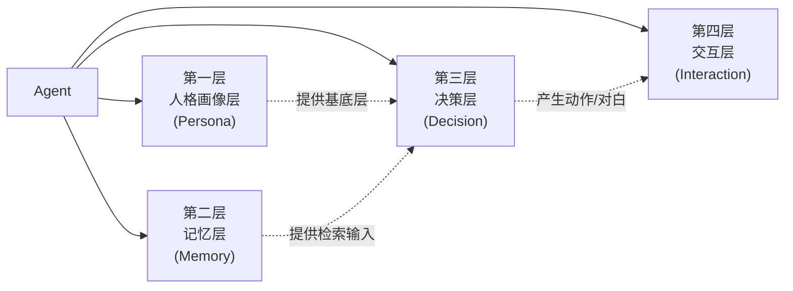
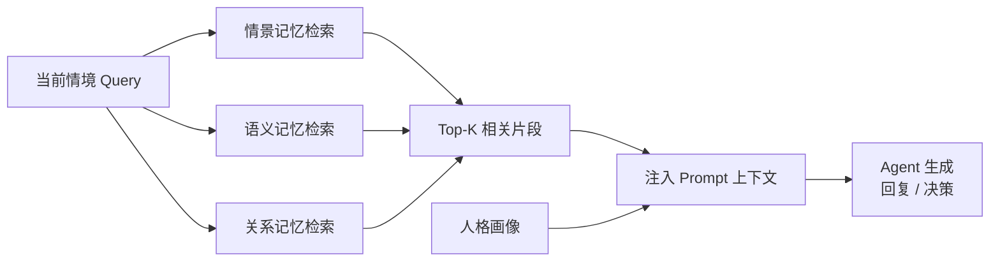
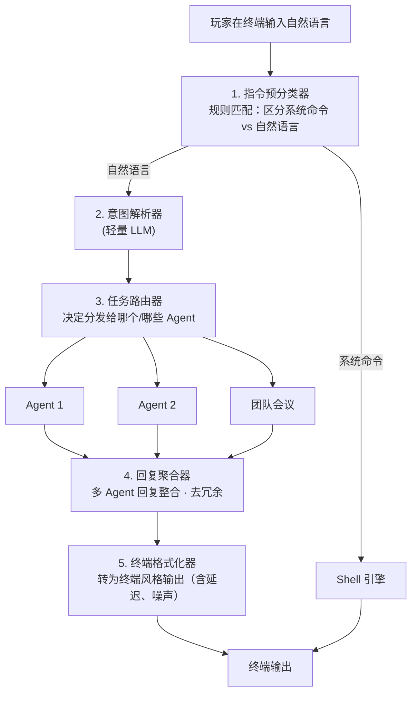
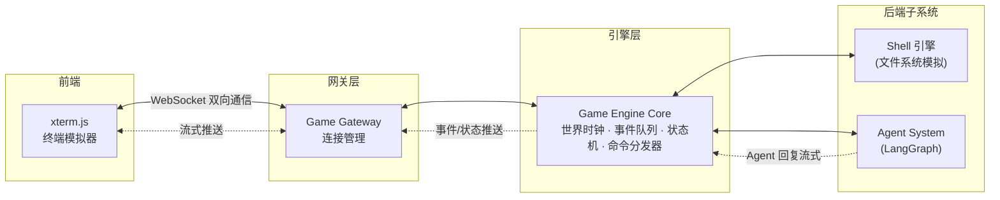
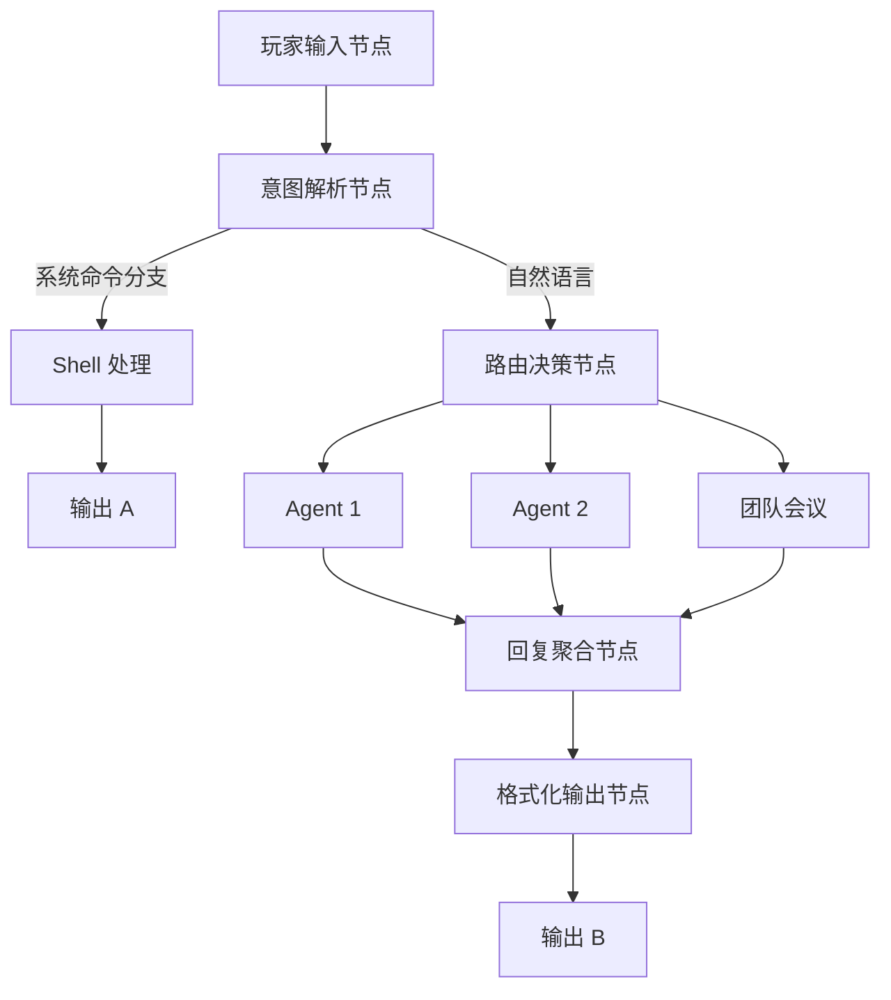

# 火星基地多智能体文字剧情沙盒游戏 —— 技术架构设计方案

> **文档版本**：v2.0（按统一文档标准修订）  
> **作者**：云逸-架构技术总监  
> **日期**：2026-08-02  
> **阶段**：系统设计（不写代码）

---

## 0. 项目背景与设计目标

### 0.1 游戏概念回顾

- **背景**：100 年后的未来，一支 LLM 驱动的科研小组被困火星基地
- **玩家视角**：通过自建信号中继连接卫星，以类 Unix 终端界面与基地交互
- **核心玩法**：探索信息、观察资源、用自然语言与基地小组交流并指导其行动
- **技术核心**：多智能体系统（Multi-Agent System）+ 文字剧情沙盒

### 0.2 架构设计目标

| 目标 | 说明 |
|------|------|
| **智能体真实感** | 每个 NPC Agent 拥有独立人格、记忆与决策逻辑，能自主行动与协作 |
| **玩家沉浸感** | 终端界面模拟真实 Unix Shell，信息有层级、有延迟、有噪声，增强"远程指挥"代入感 |
| **剧情涌现性** | 不走硬编码分支树，通过 Agent 自主行为 + 事件系统 + 玩家干预产生涌现叙事 |
| **可扩展性** | Agent 角色、事件类型、基地设施均可通过配置扩展，不改核心引擎 |
| **成本可控** | LLM 调用是最大成本点，架构须支持调用降级、缓存、模型分级路由 |

---

## 1. 多智能体系统架构

### 1.1 总体架构概览



### 1.2 Agent 角色设计框架

每个基地科研成员都是一个**人格化 Agent**，由四层结构组成：



#### 第一层：人格画像层（Persona Layer）

定义 Agent 的"是谁"，是所有行为与对话的基底。

```yaml
# Agent 人格画像结构（示意）
agent_id: "cmd_chen"
name: "陈远舟"
role: "基地指挥官"
age: 47
background: |
  前 ESA 指令长，三次深空任务经验。
  妻子在国内地球，女儿 12 岁。
  性格沉稳但内心焦虑，习惯独自承担压力。
personality:
  big_five:
    openness: 0.7        # 愿意接受新方案
    conscientiousness: 0.9  # 极强责任感
    extraversion: 0.4    # 偏内向
    agreeableness: 0.6
    neuroticism: 0.55    # 压力下易焦虑
  speech_style: "简洁、军事化、偶尔流露脆弱"
  values: ["团队安全第一", "服从理性", "不抛弃同伴"]
  fears: ["无法带团队回家", "氧气耗尽", "女儿失去父亲"]
expertise:
  - 航天工程
  - 应急决策
  - 团队管理
emotional_baseline:
  stress: 0.3
  morale: 0.6
  trust_in_player: 0.4   # 对远程陌生人的初始信任度
```

#### 第二层：记忆层（Memory Layer）

| 记忆类型 | 存储方式 | 用途 | 生命周期 |
|----------|----------|------|----------|
| **工作记忆** | Context Window（对话上下文） | 当前对话、正在执行的任务 | 单次交互 |
| **情景记忆** | 向量数据库 + 时间戳 | 亲身经历的关键事件（如"第3天氧气泄漏"） | 永久，按相关性检索 |
| **语义记忆** | 向量数据库 / 结构化知识 | 基地布局、同事关系、专业知识 | 永久，初始化时注入 |
| **关系记忆** | 结构化（图/表） | 对其他 Agent 和玩家的印象与信任度 | 动态更新 |
| **反思记忆** | 定期 LLM 总结生成 | 从近期事件中提炼的经验与信念 | 每天 game-tick 生成 |

**记忆检索流程**（检索增强生成 RAG）：



#### 第三层：决策层（Decision Layer）

采用 **ReAct（Reasoning + Acting）模式** 变体，分为三档：

| 决策模式 | 触发条件 | 机制 | 成本 |
|----------|----------|------|------|
| **反射式** | 日常例行行为 | 直接查规则表，不调用 LLM | 极低 |
| **审慎式** | 需要判断但非关键 | 单次 LLM 推理（轻量模型） | 中 |
| **深思式** | 危机决策、伦理抉择 | ReAct 多步推理 + 可能触发团队会议 | 高 |

**决策输入**：
- 人格画像（静态）
- 检索到的相关记忆
- 当前世界/基地状态
- 当前情绪状态（stress、morale 影响决策偏好）
- 个人目标 + 团队目标

**决策输出**：
- 动作（Action）：移动、操作设备、使用资源、与其他 Agent 对话
- 对白（Dialogue）：对玩家或同事说的话
- 情绪更新：事件结束后调整 stress/morale/trust 值

#### 第四层：交互层（Interaction Layer）

Agent 之间通过**内部消息通道**通信，架构上使用 **LangGraph 的多 Agent 通信机制**。

**通信模式**：

| 模式 | 说明 | 示例 |
|------|------|------|
| **直接对话** | Agent A 向 Agent B 发起对话 | 指挥官向工程师下达指令 |
| **团队会议** | 多 Agent 群聊决策，由 Orchestrator 编排多轮对话 | 危机时商讨方案 |
| **黑板模式** | 共享"基地公告板"，Agent 可读取/发布异步信息 | "走廊发现裂缝" |

**自主行为循环（Game Tick Loop）**：

```python
# 伪代码：每 game tick（约 = 游戏内 30 分钟）执行
for agent in all_agents:
    # 1. 感知
    agent.perceive(world_delta, incoming_messages, self_state)
    # 2. 情绪更新
    agent.update_emotion(recent_events)
    # 3. 目标评估
    agent.reorder_goals()
    # 4. 决策（反射 / 审慎 / 深思）
    action = agent.decide()
    # 5. 执行
    agent.execute(action)  # 产出动作或对话
    # 6. 记忆写入
    if action.is_notable():
        agent.write_episodic_memory(action)
    # 7. 关系更新
    agent.update_relationships(action)

# 每 N 个 tick 触发反思
if current_tick % REFLECTION_INTERVAL == 0:
    for agent in all_agents:
        agent.reflect()  # 总结近期经历，更新信念与长期策略
```

### 1.3 Agent 角色设计建议

基于"科研小组被困火星"的设定，建议初始 4-5 个 Agent：

| Agent | 角色 | 专业领域 | 性格关键词 | 在团队中的功能 |
|-------|------|----------|------------|----------------|
| 陈远舟 | 基地指挥官 | 航天工程/应急决策 | 沉稳、焦虑、责任感 | 决策中枢、玩家主要对话人 |
| 艾琳·沃克 | 生命维持工程师 | 机械/环控 | 务实、直率、有黑色幽默 | 设备维护、资源评估 |
| 雷牧·黑原 | 地质/矿物学家 | 地质勘探/火星地质 | 好奇、执拗、学者气 | 地表勘探、科研推进 |
| 苏菲·林 | 医疗官兼生物学家 | 医学/封闭生态 | 温和、敏锐、有共情力 | 健康监控、心理疏导 |
| （可选）V-9 | 基地 AI 助手 | 数据管理 | 机械、略带人格碎片 | 信息检索辅助、剧情线索 |

> Agent 数量建议控制在 4-6 个。每增加一个 Agent，LLM 调用成本与编排复杂度线性增长。

### 1.4 Agent 人格一致性保障

这是技术难点：**确保 LLM 扮演的角色在长对话中不崩坏**。

| 策略 | 实现方式 |
|------|----------|
| **System Prompt 强约束** | 每次调用都注入完整人格画像摘要 |
| **风格示例库** | 为每个 Agent 准备 5-10 条"典型台词"作为 few-shot |
| **违规检测** | 轻量模型校验输出是否符合人设（如指挥官不该说网络梗） |
| **温度控制** | 关键 Agent 用低 temperature，日常可适当提高 |
| **定期人格校准** | 反思阶段自检"我最近的表现是否符合我的性格" |

---

## 2. Agent 与玩家交互机制

### 2.1 交互流水线总览



### 2.2 指令预分类器（Pre-Classifier）

玩家输入的第一道关卡，**用规则而非 LLM**，降低成本：

```python
import re

def pre_classify(user_input: str) -> str:
    # 匹配系统命令前缀
    if re.match(r'^(ls|cat|cd|top|ping|status|pwd|less|head|tail|talk|broadcast|relay|connect|signal|help|history|clear|man)\s*', user_input):
        return "shell_command"
    # 匹配显式对话触发词
    elif user_input.startswith('@') or user_input.startswith('talk to'):
        return "natural_language"
    # 默认按自然语言处理（容错）
    else:
        return "natural_language"
```

### 2.3 意图解析器（Intent Parser）

使用轻量 LLM（如 GPT-4o-mini / Qwen-Turbo）将自然语言结构化：

**输出结构**：

```json
{
  "intent_type": "command | inquiry | suggestion | emotional | smalltalk",
  "target_agents": ["cmd_chen"],
  "action_hint": "request_status_report",
  "urgency": "normal",
  "semantic_content": "玩家想知道当前氧气还能撑多久",
  "requires_team_meeting": false
}
```

**意图分类**：

| 意图类型 | 示例 | 处理方式 |
|----------|------|----------|
| command | "让艾琳去修一下空气过滤器" | 路由到目标 Agent，生成行动决策 |
| inquiry | "现在基地资源情况如何" | 路由到最合适的 Agent 或直接查状态 |
| suggestion | "我觉得应该优先修通讯设备" | 路由给指挥官，影响目标优先级 |
| emotional | "你们一定要撑住" | 路由给全员，影响 morale/trust |
| smalltalk | "今天怎么样" | 路由给随机空闲 Agent，低成本闲聊 |

### 2.4 任务路由器（Task Router）

**路由规则**（按优先级从高到低）：

| 优先级 | 规则 | 说明 |
|--------|------|------|
| 1 | **显式指定** | 玩家 @ 了某人 → 直接路由 |
| 2 | **专业匹配** | 意图涉及"维修"→ 工程师；"医疗"→ 医疗官 |
| 3 | **指挥链** | 策略级指令默认路由给指挥官，由指挥官决定是否向下传达 |
| 4 | **广播模式** | 情感支持类指令广播给全员，但只让最闲的 1-2 个回复 |

**关键设计——指挥链模拟**：

玩家不直接指挥每个成员，而是主要与指挥官对话。指挥官会：
- 自行判断是否需要转达给下属
- 用自己的风格复述玩家指令（可能走样，受人格影响）
- 下属可能执行、质疑或拒绝

> 这条机制是剧情涌现的核心来源之一：**信息传递的失真与抗拒**。

### 2.5 Agent 回复生成

被激活的 Agent 接收以下上下文生成回复：

| 上下文段 | 内容 |
|-----------|------|
| System Prompt | 完整人格画像 |
| 记忆检索 | 相关情景/语义记忆 Top-K |
| 当前状态 | 情绪、体力、正在做的事 |
| 对话历史 | 与玩家/同事的近期对话 |
| 输入 | 玩家原始消息 + 意图解析结果 |

**输出**：回复文本 + 副作用（情绪变化、行动决定）

**回复约束**：
- 长度控制：日常 ≤ 80 词，紧急 ≤ 150 词
- 风格一致性
- 信息量适度：不该一次说完，要留"追问空间"推动剧情

### 2.6 回复聚合器

当多个 Agent 同时回复时：

1. 按对话逻辑排序（如指挥官先说，下属补充）
2. 去除重复信息
3. 添加 Agent 间互动（如下属反驳指挥官）

### 2.7 终端格式化器

将 Agent 回复包装成终端风格输出：

| 效果 | 说明 |
|------|------|
| 信号延迟 | 关键信息可设 1-3 秒延迟 |
| 信号噪声 | 低信号强度时文字乱码/缺失 |
| 信道标识 | `[CHEN]>` `[WALKER]>` 等 |

---

## 3. 终端界面架构

### 3.1 设计哲学

终端不是装饰，是**核心交互媒介**。要营造"我坐在地球某处地下室，用破旧设备远程指挥火星"的沉浸感。

三个关键体验：

| 体验 | 说明 |
|------|------|
| **信息不对称** | 玩家只能看到"信号能传过来的"信息，有延迟、有缺失 |
| **操作受限感** | 不能直接操控 Agent，只能"建议/命令/沟通"，Agent 有自主意志 |
| **真实系统感** | 命令行有错误、有权限、有路径结构 |

### 3.2 命令系统设计

#### 命令分类

| 类别 | 命令示例 | 功能 |
|------|----------|------|
| **导航** | `ls`, `cd`, `pwd` | 浏览虚拟文件系统（基地数据目录） |
| **查看** | `cat <file>`, `less`, `head`, `tail` | 查看日志、报告、Agent 资料 |
| **状态** | `status`, `top`, `watch` | 实时资源/Agent 状态监控 |
| **通讯** | `talk <agent>`, `broadcast`, `ping` | 与 Agent 通讯 |
| **设备** | `relay`, `connect`, `signal` | 管理玩家侧信号中继设备 |
| **系统** | `help`, `history`, `clear`, `man` | 终端元操作 |

#### 虚拟文件系统结构

- `/mars-base/`
  - `agents/` — Agent 信息（可查看的公开部分）
    - `chen.profile`
    - `walker.profile`
    - ...
  - `logs/` — 基地系统日志
    - `system/`
    - `resource/`
    - `comms/`
  - `resources/` — 资源状态文件（实时刷新）
    - `oxygen.stat`
    - `power.stat`
    - `water.stat`
    - `food.stat`
  - `reports/` — Agent 提交的报告
  - `maps/` — 基地/周边地图
  - `inbox/` — 玩家收件箱（Agent 主动发来的消息）

#### 命令行为分层

| 层级 | 说明 | 示例 |
|------|------|------|
| **即时执行** | 读本地缓存，无延迟 | `ls`, `pwd`, `cat` 静态文件 |
| **同步查询** | 查询后端状态，有轻微延迟 | `status`, `top` |
| **异步交互** | 触发 Agent 行为，需等待回复 | `talk chen "该不该出去勘探"` |
| **延迟执行** | 指令下达后 Agent 逐步执行，反馈延后 | 指挥官调度任务 |

### 3.3 信息展示层级

终端界面分为四个区域，自上而下：

| 层级 | 区域 | 内容 | 示例 | 刷新方式 |
|------|------|------|------|----------|
| L1 | 状态条 | 核心生存指标 | `Day 14 | O2: 62% | PWR: 78%` | 定时轮询 |
| L2 | 命令行 | 玩家输入 | `$ talk chen "氧气还够几天"` | 交互式 |
| L2 | 命令行 | 信号状态提示 | `[信号延迟 2.3s...]` | 自动 |
| L3 | 对话流 | Agent 回复 | `[CHEN]> 按当前消耗率还能撑 4 天。但雷牧想出去采样，我不同意。` | WebSocket 推送 |
| L4 | 事件日志 | 自动事件 | `[LOG 14:22] 走廊 3 号气密门异常关闭` | WebSocket 推送 |
| L4 | 事件日志 | 告警 | `[ALERT] 氧气消耗速率上升 8%` | WebSocket 推送 |

### 3.4 数据流架构



**数据流方向**：

| 编号 | 流向 | 说明 |
|------|------|------|
| 1 | 玩家输入 → Gateway → Engine → Shell 引擎 / Agent System | 上行请求 |
| 2 | Agent 回复 → 流式推送到 Gateway → 前端逐字渲染 | 下行流式 |
| 3 | 世界事件 → Engine → Gateway → 推送到 L4 日志区 | 事件广播 |
| 4 | 状态变化 → Engine → Gateway → 更新 L1 状态条 | 状态同步 |

**流式输出**：Agent 回复应流式传输（SSE/WebSocket），模拟终端逐字打印效果。

---

## 4. 游戏状态管理

### 4.1 核心数据结构概览

- **GameState**
  - WorldState — 世界层
  - BaseState — 基地层
  - AgentStates[] — Agent 层（每个成员一个）
  - PlayerState — 玩家层
  - EventQueue — 事件层
  - MetaState — 元数据（存档信息、游戏时间等）

### 4.2 WorldState（世界状态）

| 字段 | 类型 | 说明 |
|------|------|------|
| `mars_time` | datetime | 火星本地时间 |
| `sol` | int | 第几个火星日（Sol 1, 2, 3...） |
| `weather.temperature` | float | 外部温度（-60℃ ~ +20℃） |
| `weather.dust_storm` | float | 沙尘暴强度 0~1 |
| `weather.solar_radiation` | float | 太阳辐射强度 |
| `day_night` | bool | 昼/夜 |
| `external_events` | list | 外部随机事件池（陨石、太阳风暴...） |

### 4.3 BaseState（基地状态）

| 字段 | 类型 | 说明 |
|------|------|------|
| `facilities` | dict | 设施状态，key=设施ID，value=FacilityState |
| `facilities[*.status]` | enum | `normal` / `malfunction` / `damaged` |
| `facilities[*.integrity]` | float | 完整度 0~1 |
| `resources.oxygen` | ResourceState | 当前量 / 最大容量 / 消耗速率 / 产出速率 |
| `resources.power` | ResourceState | 同上 |
| `resources.water` | ResourceState | 同上 |
| `resources.food` | ResourceState | 同上 |
| `resources.materials` | dict | 各种材料库存 |
| `integrity` | float | 基地整体结构完整度 0~1 |
| `sections` | dict | 各区域状态：温度/气压/可达性/在场 Agent |

### 4.4 AgentState（Agent 状态）

| 字段 | 类型 | 说明 |
|------|------|------|
| `agent_id` | str | Agent 唯一标识 |
| `location` | str | 当前所在区域 |
| `health.physical` | float | 体能 0~1 |
| `health.mental` | float | 精神 0~1 |
| `health.injuries` | list | 伤情列表 |
| `emotion.stress` | float | 压力值 |
| `emotion.morale` | float | 士气值 |
| `emotion.trust_in_player` | float | 对玩家信任度 |
| `inventory` | list | 携带物品 |
| `current_task` | TaskState | 正在执行的任务 |
| `schedule` | list | 今日计划 |
| `relationships` | dict | 对其他 Agent 的关系值 |
| `last_active_tick` | int | 最后活跃 tick |

### 4.5 PlayerState（玩家状态）

| 字段 | 类型 | 说明 |
|------|------|------|
| `relay_status.signal_strength` | float | 0~1，影响信息完整度 |
| `relay_status.bandwidth` | float | 影响响应延迟 |
| `relay_status.battery` | float | 设备电量 |
| `discovered_info` | set | 已发现的信息（解锁的日志/地图等） |
| `trust_level` | dict | 各 Agent 对玩家的信任度缓存 |
| `command_history` | list | 历史指令 |

### 4.6 EventQueue（事件队列）

事件系统是涌现叙事的引擎。

**Event 结构**：

| 字段 | 类型 | 说明 |
|------|------|------|
| `event_id` | str | 事件唯一标识 |
| `trigger_time` | tick | 触发的 game tick |
| `type` | enum | `scheduled` / `random` / `triggered` / `chain` |
| `category` | enum | `crisis` / `routine` / `discovery` / `character` |
| `payload` | dict | 事件具体数据 |
| `effects` | list | 对世界/Agent 的状态修改 |
| `choices` | list | 可选处理方式（供 Agent/玩家决策） |
| `chain_events` | list | 衍生事件 ID |

**EventQueue 结构**：

| 子队列 | 数据结构 | 用途 |
|--------|----------|------|
| `scheduled` | 优先队列（按 tick 排序） | 定时事件 |
| `pending` | 列表 | 等待条件触发的条件事件 |
| `active` | 列表 | 正在进行中的事件 |
| `history` | 列表 | 已结束事件（归档） |

**事件类型**：

| 类型 | 示例 | 触发方式 |
|------|------|----------|
| 定时事件 | 第 5 天太阳风暴 | 时间到点触发 |
| 随机事件 | 设备故障 | 概率抽签 |
| 条件事件 | 氧气 < 20% 触发全员焦虑 | 状态监听 |
| 链式事件 | 指挥官决定外出 → 触发沙尘暴 → Agent 受困 | 前序事件结果触发 |

### 4.7 状态持久化策略

采用**快照 + 事件日志（Event Sourcing）混合**：

| 机制 | 用途 | 频率 |
|------|------|------|
| **定时快照** | 完整序列化 GameState，用于存档/读档 | 每 Sol（游戏日）或玩家主动存档 |
| **事件日志** | 记录所有状态变更事件，用于回放/调试 | 实时追加 |
| **记忆持久化** | Agent 记忆独立存入向量库 | 写入时即持久化 |

**恢复流程**：读最近快照 → 重放后续事件日志 → 恢复完整状态。

---

## 5. 技术选型建议

### 5.1 技术栈总览

| 层 | 技术选型 | 备选 | 选择理由 |
|----|----------|------|----------|
| **后端语言** | Python 3.11+ | — | LangChain 生态首选、AI 应用成熟 |
| **Agent 编排** | LangGraph | AutoGen | 状态机式多 Agent 流程，可控性强 |
| **LLM 框架** | LangChain | LlamaIndex | 生态完整、Prompt 工程与记忆管理成熟 |
| **主推理 LLM** | GPT-4o / Claude 3.5 Sonnet | Qwen-Max | Agent 核心决策与对话，质量优先 |
| **轻量 LLM** | GPT-4o-mini / Qwen-Turbo | — | 意图解析、格式校验等低成本任务 |
| **向量记忆** | ChromaDB | FAISS / Qdrant | 轻量易部署，Python 原生集成好 |
| **Embedding** | text-embedding-3-small | bge-m3 | 成本与质量平衡 |
| **结构化存储** | SQLite | PostgreSQL | 单机游戏初期足够，可平滑迁移 |
| **实时状态/缓存** | Redis | — | 事件队列、在线状态、会话缓存 |
| **前端终端** | xterm.js | — | 浏览器端成熟终端模拟器 |
| **实时通信** | WebSocket (FastAPI) | — | 流式输出 + 双向通信 |
| **后端框架** | FastAPI | Flask | 异步原生、WebSocket 友好 |

### 5.2 LangChain / LangGraph 集成方案

**职责分工**：

| 框架 | 负责模块 |
|------|----------|
| **LangChain** | Prompt 模板管理、记忆检索（Memory + Retriever）、工具调用、输出解析与结构化 |
| **LangGraph** | 多 Agent 状态流转编排、Agent 间通信图、玩家指令→路由→聚合有向图、Checkpoint 状态保存 |

**LangGraph 状态图**：



### 5.3 向量记忆方案

**双库设计**：

| 向量库 | 存什么 | 检索方式 |
|--------|--------|----------|
| **情景记忆库** | Agent 亲身经历的事件 | 时间 + 语义混合检索 |
| **语义知识库** | 基地蓝图、专业知识、人物关系 | 纯语义检索 |

**记忆写入流程**：

1. 事件发生 → 提取关键信息 → 生成摘要 + 时间戳
2. Embedding → 写入向量库
3. 同时写结构化元数据（时间、涉及 Agent、事件类型）

**记忆检索策略**：

| 策略 | 说明 |
|------|------|
| **近期优先** | 最近 N 个 tick 的事件加权 |
| **情感加权** | 高情绪强度事件更易被想起 |
| **相关性** | 语义相似度 Top-K |

### 5.4 LLM 成本控制策略

这是项目能否商业可行的关键。

| 策略 | 节省幅度 | 实现方式 |
|------|----------|----------|
| **模型分级路由** | 60-70% | 反射式不调 LLM；审慎式用轻量模型；仅深思式用大模型 |
| **对话缓存** | 20-30% | 相同/相似问题缓存回复（语义缓存） |
| **批量推理** | 10-20% | 多 Agent 的自主行为 tick 批量生成 |
| **上下文压缩** | 显著 | 记忆检索后压缩为摘要注入，而非全文 |
| **空闲降频** | 中等 | 无玩家交互时，Agent tick 频率降低 |

### 5.5 部署架构（建议方向）

**初期单机部署**：

- FastAPI + WebSocket 服务
- LangGraph Agent 运行时
- SQLite + Redis
- ChromaDB（嵌入式）

**规模化后集群部署**：

- API 网关集群（水平扩展）
- Agent Worker 集群（独立进程，消息队列驱动）
- PostgreSQL + Redis 集群
- Qdrant / Milvus 向量库集群
- LLM API 代理层（负载均衡 + 缓存 + 限流）

---

## 6. 项目目录结构建议

- `mars-base/`
  - `backend/`
    - `engine/` — 游戏引擎核心
      - `world.py` — 世界状态与时钟
      - `events.py` — 事件系统
      - `state.py` — 状态管理
      - `shell.py` — 终端命令引擎
    - `agents/` — Agent 系统
      - `base.py` — Agent 基类
      - `memory.py` — 记忆层
      - `persona.py` — 人格层
      - `orchestrator.py` — LangGraph 编排
      - `characters/` — 具体角色定义（YAML）
    - `llm/` — LLM 集成
      - `client.py` — 统一客户端
      - `prompts/` — Prompt 模板
      - `cache.py` — 语义缓存
    - `api/` — 对外接口
      - `websocket.py` — WS 连接
      - `routes.py` — HTTP 路由
    - `data/` — 持久化
      - `db.py` — SQLite/PG
      - `redis_client.py`
      - `vectorstore.py` — ChromaDB
    - `config/` — 配置
  - `frontend/`
    - `terminal/` — xterm.js 封装
    - `components/`
    - `styles/`
  - `content/` — 游戏内容资产
    - `agents/` — Agent 人格定义
    - `events/` — 事件脚本
    - `world/` — 世界设定
  - `tests/`
  - `docs/`

---

## 7. 关键风险与对策

| 风险 | 影响 | 对策 |
|------|------|------|
| LLM 调用成本失控 | 项目不可持续 | 分级路由 + 缓存 + 空闲降频（见 5.4） |
| Agent 人格崩坏 | 沉浸感丧失 | 人格校准机制 + few-shot + 违规检测（见 1.4） |
| 涌现剧情失控 | 出现不合理情节 | 事件系统设定边界 + 关键节点 LLM 校验逻辑合理性 |
| 响应延迟高 | 玩家体验差 | 流式输出 + 信号延迟"化劣势为设计"（终端风格本就需要延迟） |
| 多 Agent 死锁 | 剧情停滞 | Orchestrator 设置超时 + 兜底默认行为 |
| 上下文窗口溢出 | 记忆丢失 | 记忆压缩 + 滑动窗口 + RAG 按需检索 |

---

## 8. 下一步建议

1. **先做垂直原型验证**：1 个 Agent + 3 个命令 + 基础终端，验证核心链路通畅
2. **人格定义先行**：蔚蓝（游戏策划）输出 4 个 Agent 的完整人物设定 YAML
3. **事件库设计**：蔚蓝设计 10-20 个典型事件剧本，验证事件系统数据结构
4. **前端终端 demo**：千机（引擎实现）可用 xterm.js 搭最小可用终端
5. **LLM 选型实测**：锐锋（开发）用 LangChain 跑通"单 Agent 对话 + 记忆检索"链路，评估延迟与成本

> 我会基于本方案，在后续阶段输出**详细接口定义**与**核心模块伪代码架构图**，供锐锋落地实现时参考。

---

*本方案为系统设计阶段产出，具体实现将在方案评审通过后展开。欢迎团队成员提出修改建议。*
