# 项目架构与引擎化分析报告 v1.0

> 作者：锐锋-核心开发工程师　日期：2026-08-08
> 范围：赫拉克勒斯协议（mars-base-sandbox）当前架构梳理 + 模块化引擎化目标架构设计
> 修订：2026-08-09 — 修正引擎化目的：从"多题材/主题切换"改为"单一固定配置的数据驱动，便于进一步开发"；同步更新前端风格为 terra-faction-ui。

---

## 一、项目定位与现状速览

赫拉克勒斯协议是一款**地球观察者 ↔ 火星基地**的对话式叙事生存游戏。玩家通过 WebSocket 终端与 6 名 NPC + 2 个 AI 系统通信，推进 Sol（火星日）周期、管理资源、触发剧情分支、达成多结局。

| 维度 | 现状 |
|------|------|
| 后端 | Python 3.10+，LangGraph + LangChain + ChromaDB + websockets，13 个 agent 模块 |
| 前端 | 零构建工具链，纯静态（xterm.js 5.5.0 + 原生 JS + 原生 CSS），CDN 加载；UI 风格 terra-faction-ui（全直角 + 切角 + 平面/标尺分隔） |
| 通信 | 纯 WebSocket（无 REST），统一信封 `{msg_id, type, ts_tick, payload}`，17 种消息类型 |
| 数据 | YAML 驱动（4 章节 / 4 分支 / 6 NPC），`dict/theme_mars_base/` 目录 + `chapter_loader.py`/`DataLoader` 加载；EngineCore 加载单一固定配置，不支持主题切换 |
| 记忆 | ChromaDB 向量库，按 emotional_intensity 加权检索 |
| 状态 | 已实现事件驱动 7 阶段 FSM 主循环，全流程测试通过（112 步 0 ERROR） |

---

## 二、当前整体架构图

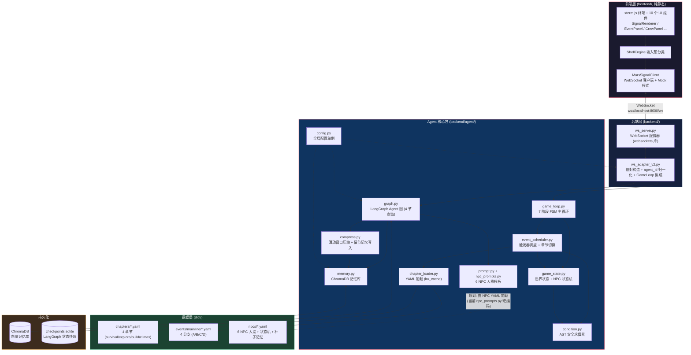

### 分层职责

| 层 | 载体 | 职责 |
|----|------|------|
| 前端层 | `frontend/` | 终端 UI、信号遮罩渲染、事件面板、输入分类、WebSocket 客户端 |
| 接入层 | `ws_server.py` + `ws_adapter_v2.py` | WebSocket 服务器、消息分发、信封构造、agent_id 归一化 |
| 编排层 | `game_loop.py` + `event_scheduler.py` | 7 阶段 FSM、触发器调度、章节切换、结局判定 |
| 状态层 | `game_state.py` + `condition.py` | 世界状态、NPC 心理状态机、资源危机、AST 安全求值 |
| Agent 层 | `graph.py` + `prompt.py` + `memory.py` + `compress.py` | LangGraph 对话图、人格模板、向量记忆、上下文压缩 |
| 数据层 | `dict/` (YAML) + `chapter_loader.py` | 章节/分支/NPC 人设的声明式定义与加载 |
| 持久化层 | ChromaDB + SQLite | 记忆向量库 + LangGraph checkpoint |

---

## 三、游玩流程时序图

### 3.1 完整一回合（自然语言对话 + :sol 推进）

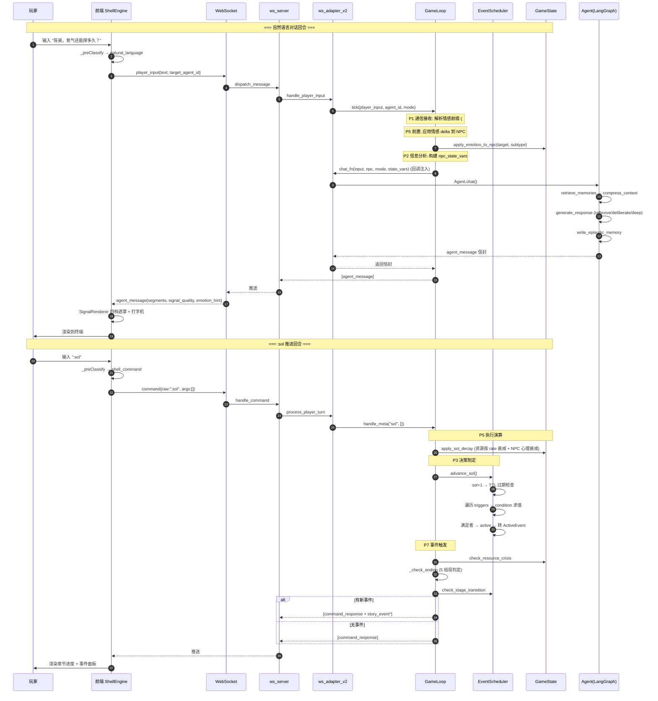

### 3.2 选项回路（事件分支选择）

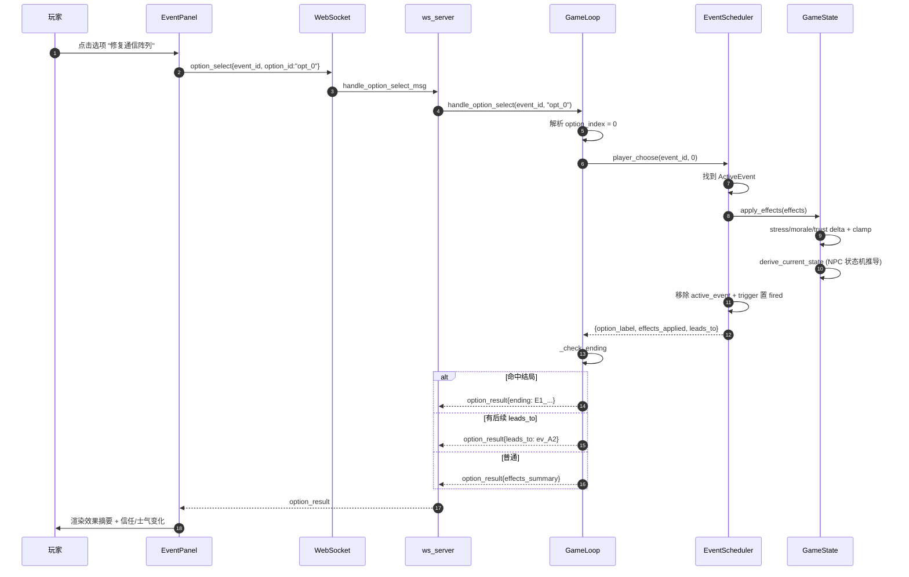

---

## 四、模块依赖关系图

### 4.1 后端 Agent 包内部依赖（5 层金字塔）

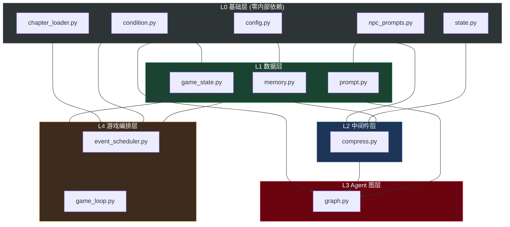

**特点**：无循环依赖，层次清晰。`game_loop.py` 是依赖金字塔顶端，聚合编排所有下层模块。

### 4.2 数据流图（YAML → 运行时状态 → 信封）

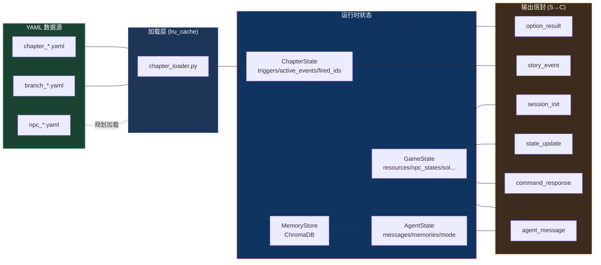

---

## 五、7 阶段 FSM 主循环详解

```mermaid
flowchart LR
    P1[P1 通信接收<br/>解析情感前缀<br/>#soothe/#command 等] --> P5a[P5前置<br/>应用情感 delta<br/>到 NPC]
    P5a --> P2[P2 信息分析<br/>构建 npc_state_vars<br/>+ game_state 摘要]
    P2 --> P4[P4 指令下达<br/>调用 Agent.chat<br/>LangGraph 4 节点链]
    P4 --> P5b[P5 执行演算<br/>仅 :sol 时<br/>apply_sol_decay]
    P5b --> P3[P3 决策制定<br/>EventScheduler<br/>检查触发器]
    P3 --> P6[P6 结果反馈<br/>构建信封<br/>agent_message/story_event]
    P6 --> P7[P7 事件触发<br/>资源危机<br/>结局判定<br/>章节切换]

    P7 -.->|"满足结局条件"| END((结局达成))
    P7 -.->|"满足章节切换"| NEXT[加载下一章节]
    P7 -.->|"继续"| P1

    classDef phase fill:#0f3460,stroke:#e94560,color:#fff
    classDef end fill:#6a040f,stroke:#e85d75,color:#fff
    classDef next fill:#1b4332,stroke:#52b788,color:#fff
    class P1,P2,P3,P4,P5a,P5b,P6,P7 phase
    class END end
    class NEXT next
```

| 阶段 | 触发场景 | 核心动作 |
|------|----------|----------|
| P1 | 每次玩家输入 | 解析 `#soothe`/`#command` 等情感前缀 |
| P2 | 每次玩家输入 | 构建 `npc_state_vars`（stress/morale/trust/energy/state） |
| P3 | `:sol` 推进 | `EventScheduler.advance_sol()` 遍历 triggers 求 condition |
| P4 | 每次自然语言 | `Agent.chat()` → LangGraph 4 节点链 |
| P5 | `:sol` 推进 | `apply_sol_decay()` 资源按 rate 衰减 + NPC 心理衰减 |
| P6 | 每次输出 | 构造 agent_message / story_event / option_result 信封 |
| P7 | `:sol`/选项后 | 资源危机检查 + 5 结局判定 + 章节切换 |

---

## 六、引擎化差距分析

当前项目是一个**与"火星基地"题材强耦合**的原型。引擎化的目的**不是支持多题材/主题切换**，而是将结局、命令、状态字段、NPC 等从硬编码迁移到 YAML，使项目**单一题材内部**的数据驱动开发成为可能，便于进一步扩展（新增事件/结局/命令）。多题材支持是更远期、高风险的工程决策，当前阶段应明确排除。

### 6.1 当前耦合点诊断

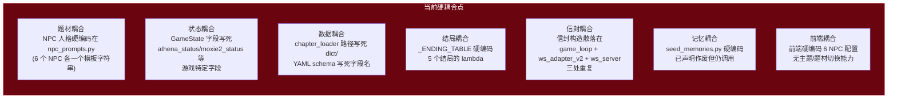

### 6.2 引擎化需抽象的模块

| # | 目标模块 | 当前散落位置 | 抽象职责 | 引擎化价值 |
|---|----------|--------------|----------|------------|
| 1 | **GameState 引擎** | `game_state.py` | 可注册的状态字段 schema + 量纲校验 | 本题材新增字段无需改代码 |
| 2 | **NPC 心理引擎** | `game_state.py` (NPC_STATE_MACHINES 等) | 通用心理状态机：状态定义 + condition 推导 + emotion_label 映射 | 心理建模与具体人设解耦 |
| 3 | **事件调度引擎** | `event_scheduler.py` | 通用触发器生命周期：trigger_type/ttl/condition/章节切换 | 新增事件无需改调度器 |
| 4 | **剧情编排引擎** | `game_loop.py` | 通用回合 FSM：阶段可配置 + meta 命令注册表 + 选项回路 | 新增命令/阶段无需改主循环 |
| 5 | **条件求值引擎** | `condition.py` | 已较通用，需扩展：自定义函数注册 + 量纲声明 | ✅ 基本就绪 |
| 6 | **数据加载引擎** | `chapter_loader.py` | 通用 YAML 加载：schema 注册 + 路径可配 + 字段校验 | 本题材数据结构可演化 |
| 7 | **Agent 对话引擎** | `graph.py` + `prompt.py` | 通用对话图：人格模板注册表 + 三档响应模式 + Mock 降级 | LLM 对话能力复用 |
| 8 | **记忆引擎** | `memory.py` + `compress.py` | 已较通用，需扩展：检索策略可插拔 + 压缩策略可配 | ✅ 基本就绪 |
| 9 | **信封/协议引擎** | `ws_adapter_v2.py` + `ws_server.py` + `game_loop.py` (散落) | 统一信封构造中心 + 消息类型注册表 + 协议版本管理 | 消除三处重复 |
| 10 | **结局引擎** | `game_loop._ENDING_TABLE` | 通用结局判定：condition → ending_id 注册表 + 判定顺序 | 新增结局无需改代码 |
| 11 | **资源引擎** | `game_state.py` (resources dict) | 通用资源系统：资源定义 + 衰减 rate + 危机阈值 + 责任区映射 | 新增资源类型可配置 |

> **注意**：上表价值列已从"不同题材复用"修正为"本题材进一步开发"，避免将引擎化误解为多题材/主题切换系统。

### 6.3 抽象优先级矩阵

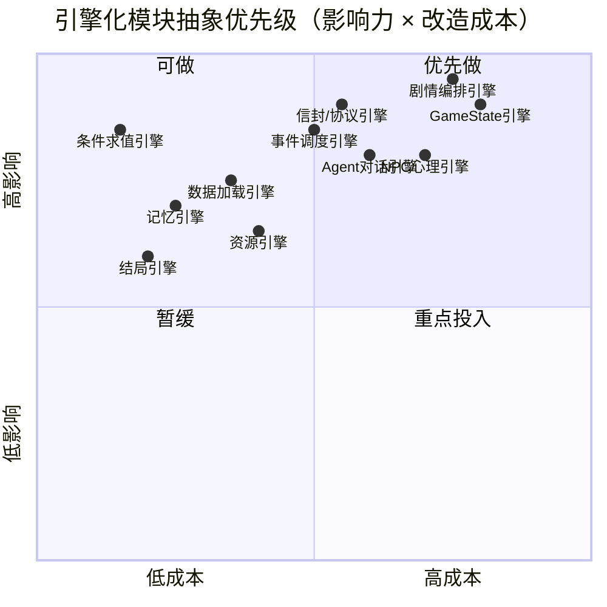

> **修正说明**：原优先级矩阵包含"主题/题材包"作为最高优先级，这是错误设计。引擎化首要目标是让本题材进一步开发无需改代码，而非支持换题材。

---

## 七、目标引擎架构设计

### 7.1 分层目标架构

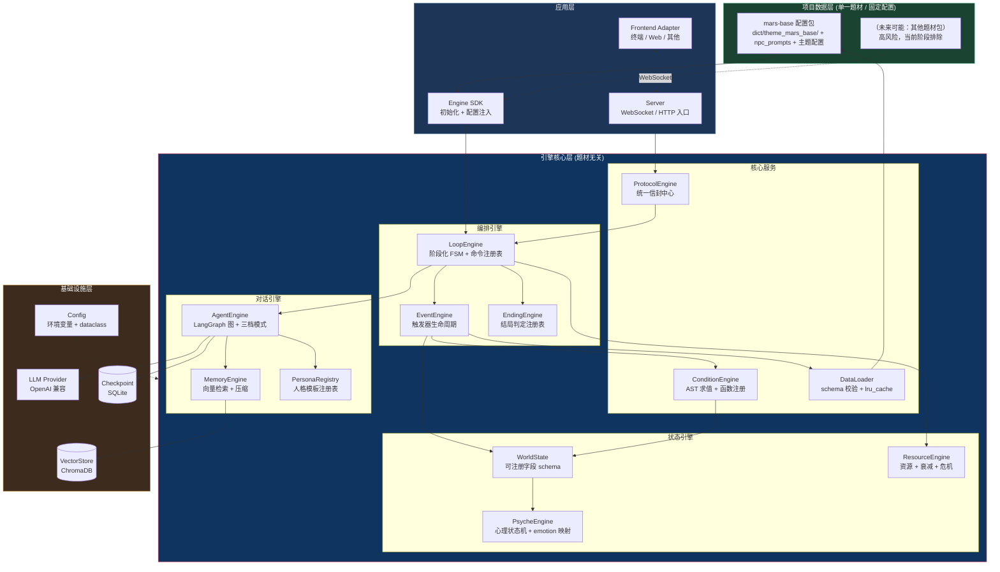

### 7.2 核心设计原则

| 原则 | 含义 | 落地方式 |
|------|------|----------|
| **单一题材内核** | 引擎核心服务于本项目固定题材，字段通过 schema 注册，不追求"题材无关" | GameState 用 `register_field()` 动态注册；结局用注册表 |
| **数据驱动** | 剧情/NPC/结局/资源全部由 YAML/JSON 定义 | 项目配置包 = 数据 + 模板，引擎只认 schema |
| **注册表模式** | 命令、人格、结局、状态字段均注册 | `CommandRegistry` / `PersonaRegistry` / `EndingRegistry` |
| **可插拔 LLM** | LLM Provider 可替换 | 统一 `LLMProvider` 接口，OpenAI/本地/Mock 三实现 |
| **协议统一** | 信封构造集中在 `ProtocolEngine` | 消除 game_loop / ws_adapter / ws_server 三处重复 |
| **渐进式迁移** | 不破坏现有原型，逐步抽取 | 引擎模块先作为 wrapper 包装现有代码，再内化；不引入多题材/主题切换 |

### 7.3 项目配置包结构设计

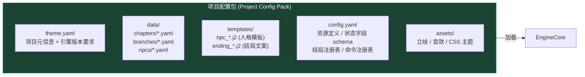

**项目配置包清单**（`theme.yaml` 示例）：

```yaml
theme_id: mars_base_hercules
theme_name: 赫拉克勒斯协议
engine_version: ">=1.0"
data:
  chapters: data/chapters/
  branches: data/events/mainline/
  npcs: data/npcs/
templates:
  persona: templates/npc_*.j2
state_schema:
  fields:
    - {name: sol, type: int, default: 1}
    - {name: athena_status, type: str, default: normal}
    - {name: athena_consciousness_flag, type: str, default: normal}
resources:
  - {name: oxygen, max: 100, rate: -0.3, threshold: 30, owner: sophia}
  - {name: power, max: 100, rate: 0.5, threshold: 20, owner: viktor}
endings:
  - {id: E7_athena_awakening, condition: "athena_consciousness_flag == 'awakening'"}
  - {id: E5_last_signal, condition: "oxygen <= 0"}
commands:
  - {name: sol, handler: advance_sol}
  - {name: npc, handler: switch_npc}
```

> **命名说明**：仍保留 `theme.yaml` 文件名以兼容现有 `DataLoader.load_theme()` 接口，但语义上指**本项目固定配置包**，而非可切换主题。

### 7.4 引擎初始化流程

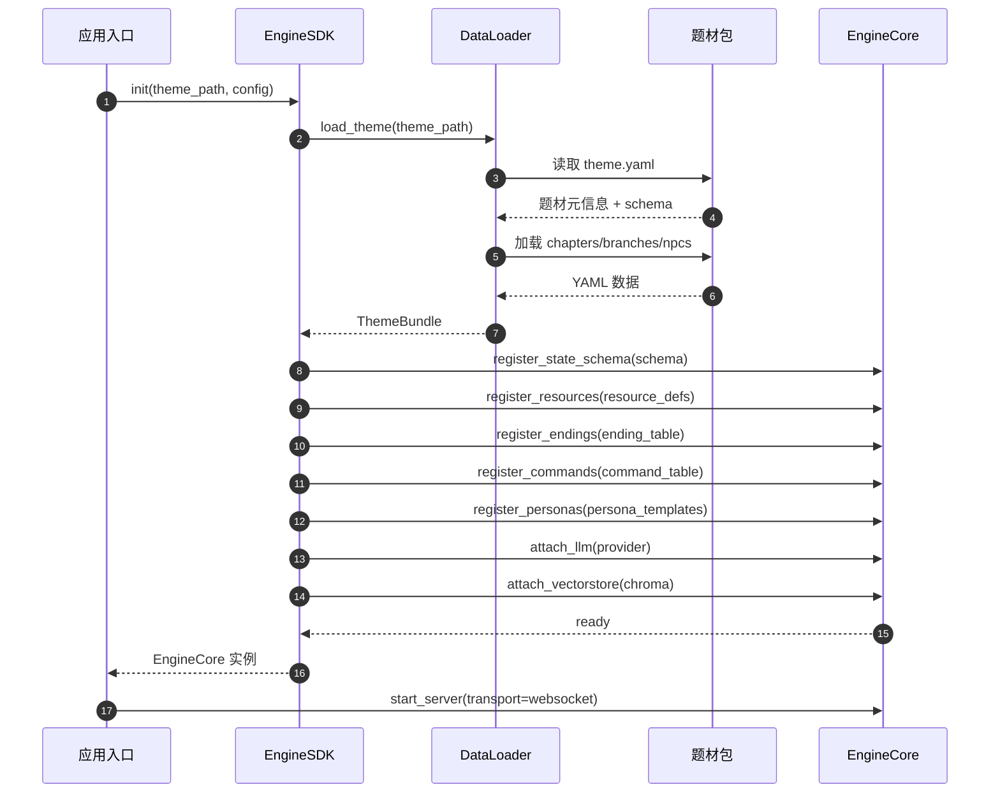

---

## 八、迁移路线图

### 8.1 三阶段演进

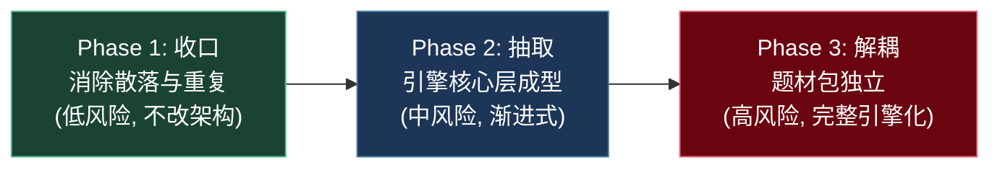

### Phase 1：收口（消除散落，不改架构）

| 任务 | 说明 |
|------|------|
| 信封构造收口 | 新建 `protocol.py`，将 game_loop / ws_adapter_v2 / ws_server 三处信封构造统一收口 |
| 结局表数据化 | `_ENDING_TABLE` 从 lambda 改为从 YAML/配置加载的 condition 字符串 |
| 种子记忆迁移 | 删除 `seed_memories.py`，改由 NPC YAML 的 `seed_memories` 字段加载 |
| 量纲统一 | stress/morale/trust 全局统一量纲（建议 0-1 或 0-100 二选一），消除 condition 上下文乘 100 的 hack |
| 废弃 v1 清理 | 删除 `ws_adapter.py`（v1 废弃版） |

### Phase 2：抽取（引擎核心层成型）

| 任务 | 说明 |
|------|------|
| 抽取 `EngineCore` | 将 GameState + EventScheduler + GameLoop 包装为 `EngineCore`，提供 `init(theme)` / `tick()` / `handle_meta()` 统一 API |
| 注册表模式 | 实现 `CommandRegistry` / `EndingRegistry` / `PersonaRegistry`，meta 命令和结局改为注册 |
| 人格模板注册 | `npc_prompts.py` 的 6 个硬编码模板 → 从 NPC YAML `persona_prompt` 字段加载（YAML 已有此字段，当前未用） |
| DataLoader schema 校验 | 加载 YAML 时按 schema 校验字段，缺失字段给出明确错误 |
| 状态字段动态注册 | GameState 支持从题材包 schema 动态注册字段（而非硬编码 `athena_status`） |

### Phase 3：解耦（项目配置包独立）

| 任务 | 说明 |
|------|------|
| 项目配置包打包 | `dict/theme_mars_base/` + 人格模板 + 主题配置 → 本项目独立可维护的配置包 |
| 前端数据驱动 | 前端 NPC 配置、资源标签、命令列表从 `session_init.world_snapshot.theme_meta` 动态渲染，而非硬编码 `npc-config.js` |
| 引擎核心收敛 | 将 GameState / EventScheduler / GameLoop 包装为 `EngineCore`，提供统一 `init(theme)` / `tick()` / `handle_meta()` API |
| 多题材排除 | **当前阶段明确排除多题材/主题切换能力**，避免过度抽象；未来如确实需要，作为独立高风险专项重新评估 |

---

## 九、关键风险与注意事项

| 风险 | 影响 | 缓解措施 |
|------|------|----------|
| **过度抽象** | 引擎化可能引入不必要复杂度，原型已能运行 | 坚持"渐进式迁移"，引擎先 wrapper 现有代码，验证后再内化；**明确排除多题材/主题切换** |
| **YAML schema 演进** | 项目配置包 schema 变更需向后兼容 | DataLoader 加 schema 版本号 + 迁移函数 |
| **LLM 成本** | 新增事件/分支可能放大 LLM 调用 | 保留 MockLLM 降级 + 三档响应模式（reflexive 不调 LLM） |
| **性能** | ChromaDB 检索 + LLM 调用是瓶颈 | 记忆 top-k=3 + 滑动窗口压缩已就绪，引擎化后保持 |
| **量纲不一致** | stress/morale 0-1 vs 0-100 双轨制是已知 bug 温床 | Phase 1 强制统一，condition 上下文不再乘 100 |
| **前端耦合** | 前端硬编码 NPC 配置，引擎化后需同步改造 | Phase 3 统一处理，前端从 `session_init.world_snapshot` 动态渲染 |
| **主题切换诱惑** | 容易将"数据驱动"误解为"可切换题材" | 在文档、接口、代码注释中反复强调：引擎化是为了本题材进一步开发，不是主题切换 |

---

## 十、结论

### 当前状态评估

赫拉克勒斯协议已实现**最小完整可玩**：事件驱动 7 阶段 FSM、6 NPC 人格接线、向量记忆召回、4 章节 + 4 分支剧情、5 结局判定、WebSocket 实时通信，全流程测试通过。架构上呈现清晰的 **5 层依赖金字塔**（L0 基础 → L4 编排），无循环依赖，代码质量良好。

### 引擎化可行性

引擎化**可行且必要**，但当前是"题材强耦合原型"，核心耦合点集中在 7 处（见 §6.1）。其中 **condition.py 和 memory.py 已基本引擎就绪**，而 **GameState / 人格模板 / 结局表 / 信封构造** 是主要待抽象对象。

### 推荐策略

采用**三阶段渐进式迁移**：Phase 1 收口（低风险，立即收益）→ Phase 2 抽取（中风险，引擎成型）→ Phase 3 解耦（中风险，项目配置包独立）。核心是**注册表模式 + 数据驱动 + 单一项目配置包**三大设计，让"火星基地"从一个 hardcoded 项目变成**单一题材内数据可驱动**的项目，便于进一步开发（新增事件/结局/命令/NPC），**明确排除多题材/主题切换能力**。

### 前端同步

本次重构已按 terra-faction-ui 设计语言完成前端 CSS 重设计：全直角、右上切角、平面/标尺分隔、表格数字、移除 CRT 辉光/扫描线装饰。详见《视觉与界面概念设计方案 v2.1》与《前端视觉规范 — CSS 参数表》。

---

## 附录：核心文件索引

| 模块 | 文件 | 行数 | 核心职责 |
|------|------|------|----------|
| 配置 | [config.py](file:///workspace/backend/agent/config.py) | 79 | 全局配置 dataclass 单例 |
| 状态 | [state.py](file:///workspace/backend/agent/state.py) | 47 | LangGraph AgentState TypedDict |
| 求值 | [condition.py](file:///workspace/backend/agent/condition.py) | 194 | AST 安全求值器（白名单） |
| 世界 | [game_state.py](file:///workspace/backend/agent/game_state.py) | 801 | GameState + NPC 状态机 + 资源危机 + Sol 衰减 |
| 加载 | [chapter_loader.py](file:///workspace/backend/agent/chapter_loader.py) | 216 | YAML 加载（lru_cache） |
| 调度 | [event_scheduler.py](file:///workspace/backend/agent/event_scheduler.py) | 469 | 触发器生命周期 + 章节切换 + TTL |
| 主循环 | [game_loop.py](file:///workspace/backend/agent/game_loop.py) | 595 | 7 阶段 FSM + meta 命令 + 选项回路 |
| Agent 图 | [graph.py](file:///workspace/backend/agent/graph.py) | 325 | LangGraph 4 节点链 + 三档模式 |
| 人格 | [prompt.py](file:///workspace/backend/agent/prompt.py) | 100 | 人格 Prompt 统一入口 |
| NPC 模板 | [npc_prompts.py](file:///workspace/backend/agent/npc_prompts.py) | 378 | 5 NPC Jinja2 模板（硬编码） |
| 记忆 | [memory.py](file:///workspace/backend/agent/memory.py) | 268 | ChromaDB 记忆库 + 加权检索 |
| 压缩 | [compress.py](file:///workspace/backend/agent/compress.py) | 225 | 滑动窗口 + 情节记忆写入 |
| WS 适配 | [ws_adapter_v2.py](file:///workspace/backend/ws_adapter_v2.py) | 599 | 信封构造 + GameLoop 集成 |
| WS 服务器 | [ws_server.py](file:///workspace/backend/ws_server.py) | 579 | websockets 服务器 + 消息分发 |
| 前端入口 | [app.js](file:///workspace/frontend/terminal/app.js) | - | 消息路由 + 组件初始化 |
| WS 客户端 | [client.js](file:///workspace/frontend/ws/client.js) | 537 | WebSocket 客户端 + Mock |
| 信号渲染 | [signal-renderer.js](file:///workspace/frontend/components/signal-renderer.js) | - | 四档遮罩 + 打字机 |
| 事件面板 | [event-panel.js](file:///workspace/frontend/components/event-panel.js) | - | 5 子组件 + v1.2/v1.3 兼容 |
