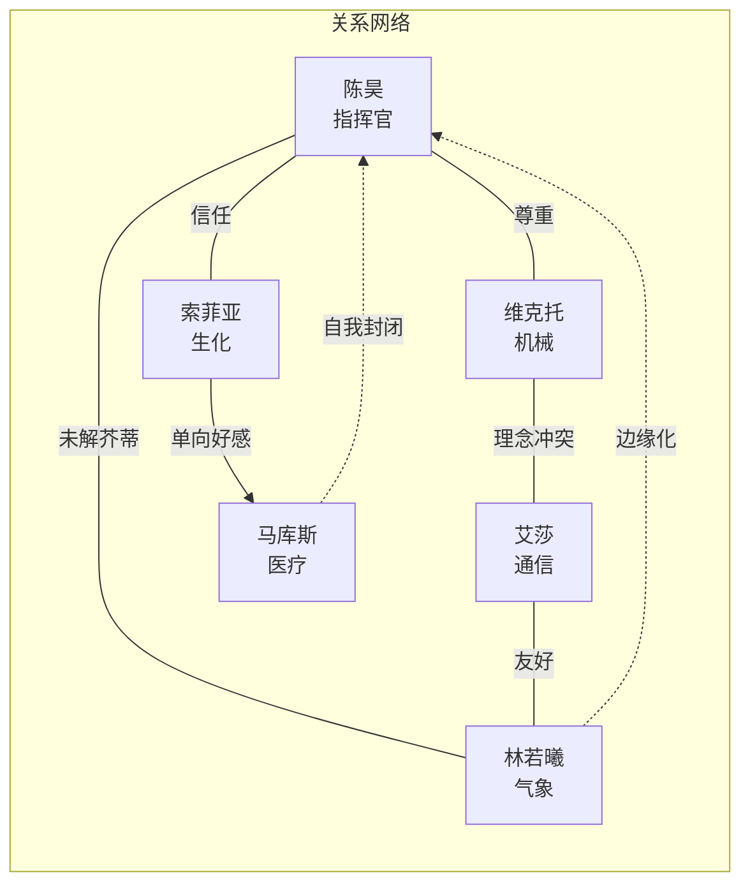
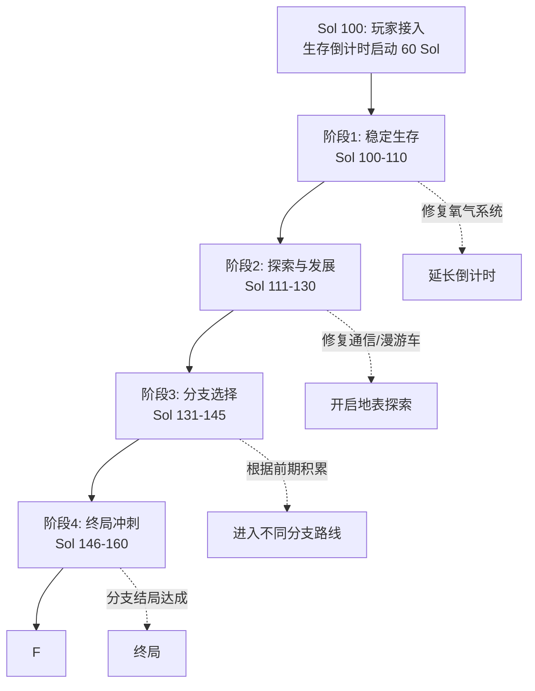
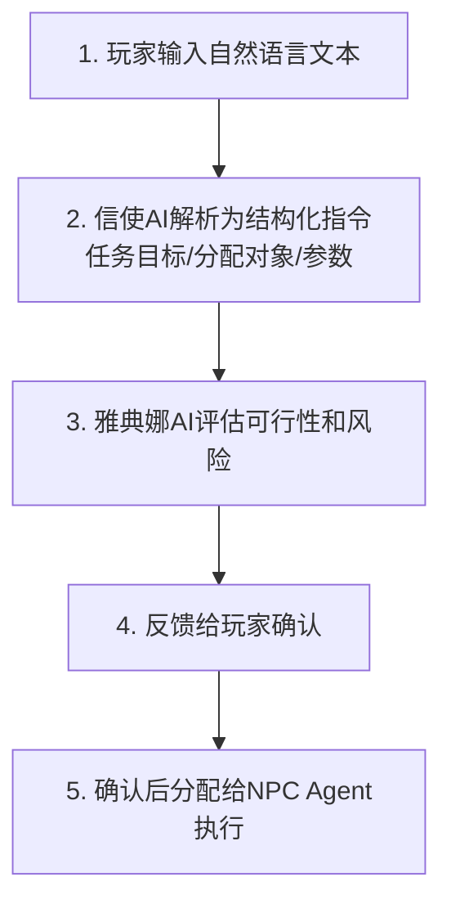
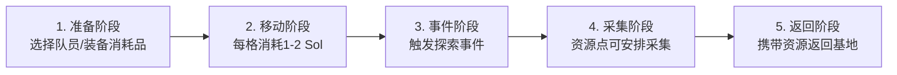
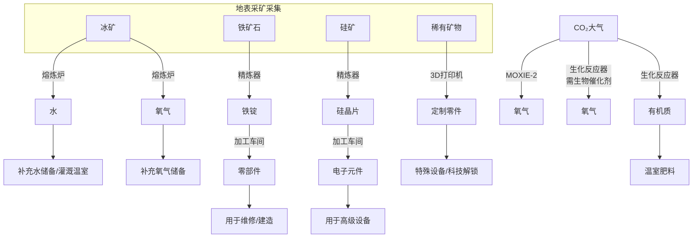
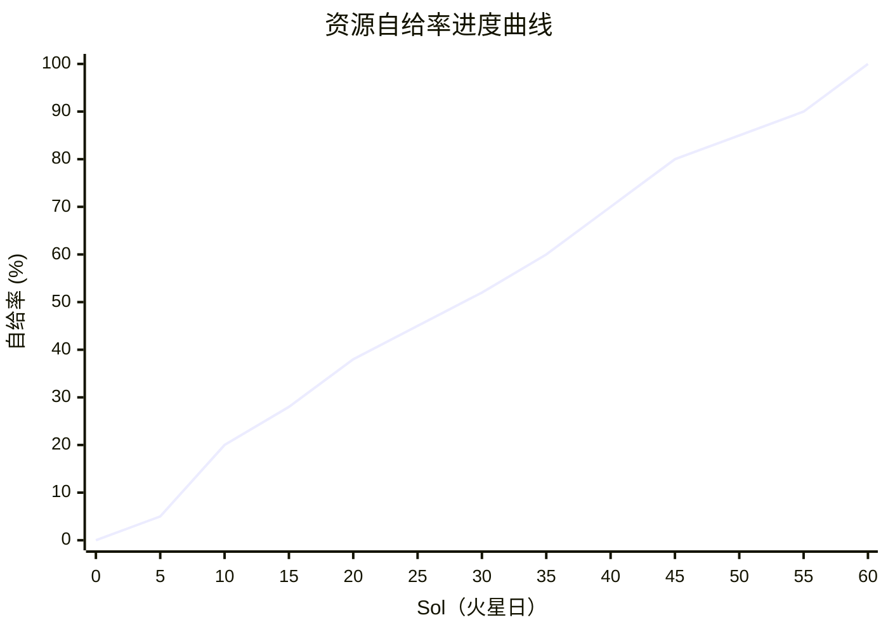

# 《赫拉克勒斯协议》—— AI 多智能体文字剧情沙盒游戏系统设计方案

> **版本**：v1.1（按统一文档标准修订）| **作者**：蔚蓝-游戏系统策划 | **日期**：2026-08-02
> **项目代号**：Heracles Protocol
> **定位**：基于 AI 小镇的多智能体文字剧情沙盒游戏
> **当前阶段**：系统设计（不含代码实现）

---

## 目录

1. [世界观与叙事设定](#1-世界观与叙事设定)
2. [核心玩法循环](#2-核心玩法循环)
3. [游戏系统划分](#3-游戏系统划分)
4. [数值与平衡设计](#4-数值与平衡设计)
5. [玩家体验流程](#5-玩家体验流程)
6. [技术实现规格摘要](#6-技术实现规格摘要)

---

## 1. 世界观与叙事设定

### 1.1 时代背景

- **时间**：公元 2126 年，人类进入"后星际时代"。
- **地球格局**：国际火星联合署（IMUA, International Mars United Administration）统筹各国力量推进火星殖民。月球基地已运营 40 年，火星已建成 6 代科研基地，第 7 代基地"赫拉克勒斯-7 号"（Heracles-7）是最新的北极科研前哨。
- **技术水平**：
  - LLM 已发展为基础 AI 架构，渗透至航天、科研、城市管理等领域。
  - 可控核聚变微型化、量子通信雏形、火星就地资源利用（ISRU）技术成熟。
  - 但星际旅行仍昂贵，地球↔火星单程运输窗口每 26 个月一次。
- **基地位置**：火星北极冠边缘的乌托邦平原（Utopia Planitia），坐标 43.0°N, 15.2°E。

### 1.2 困局缘由

赫拉克勒斯-7 号基地驻有 6 名科研人员，原定执行为期 180 火星日的科研任务。在第 83 个火星日（Sol 83），一场未预测到的超级太阳风暴（CME，日冕物质抛射）袭击了基地：

1. **主通信阵列烧毁**：基地与地球的主宽带通信链路断开，仅余一条低频应急窄带信道。
2. **撤离飞船导航系统损坏**：停靠在基地旁的返回飞行器"赫尔墨斯号"导航计算机被辐射击穿，无法自主起飞。
3. **氧气循环系统故障**：主氧气生成器（MOXIE-2）核心模块烧毁，备用系统效率仅为 35%。
4. **外部漫游车瘫痪**：两辆火星地表车电子系统受损，短期无法使用。

**当前状态**（玩家接入时）：

- 与地球失联已 **17 天**（Sol 100），地球主控中心认为基地全员牺牲，已暂停救援计划。
- 基地氧气储备仅够维持约 **60 个火星日**（Sol 160 为临界点）。
- 6 名成员被困在基地气密舱内，无法进行地表作业。

### 1.3 玩家接入设定

- **玩家身份**：地球上的航天爱好者/业余无线电工程师。
- **接入方式**：玩家在家中自建了一套信号中继站（八木天线 + 软件定义无线电 SDR + 自研解码软件），本意是截获卫星信号进行实验。
- **接入过程**：某日深夜，玩家意外截获了赫拉克勒斯-7 号通过备用低频信道（401.6 MHz）定向广播的求救脉冲信号。经解码后，玩家终端自动连接到基地的 AI 中继系统——**"信使"（Courier）**。
- **玩家角色定位**：基地唯一的外部联络人，担任远程指挥/顾问/心理支持角色。玩家不直接操控角色，而是通过自然语言与小组沟通，给出建议和指令。
- **界面形态**：类 Unix 终端界面。所有交互通过命令行 + 自然语言对话完成。

### 1.4 科研小组成员设定（6 名 NPC）

每个 NPC 由独立 LLM Agent 驱动，具有独立的性格 Prompt、知识库、情感状态和关系网络。

#### NPC 1：陈昊 / Dr. Chen Hao

| 属性 | 内容 |
|------|------|
| **身份** | 任务指挥官 / 行星地质学家 |
| **年龄** | 42岁，中国籍 |
| **性格** | 沉稳果断，责任感极强，习惯压抑情绪，领导者人格 |
| **核心能力** | 决策协调、地质分析、基地管理、团队领导 |
| **技能等级** | 领导力★5 / 地质学★5 / 机械维修★2 / 通信★1 / 医疗★1 |
| **心理锚点** | 妻子在地球待产，预产期在 Sol 120 左右——他必须活着回去 |
| **叙事功能** | 玩家最主要的沟通对象，负责汇总小组意见、做最终决策 |
| **潜在冲突** | 过度承担压力可能在 Sol 30+ 出现决策疲劳/崩溃事件 |

#### NPC 2：索菲亚·拉米雷斯 / Sofia Ramirez

| 属性 | 内容 |
|------|------|
| **身份** | 生物化学家 / 生命保障系统专家 |
| **年龄** | 31岁，墨西哥/美国双籍 |
| **性格** | 乐观开朗，黑色幽默，善于鼓舞士气，但有时轻率 |
| **核心能力** | 生物实验、氧气系统维护、水培农业、化学合成 |
| **技能等级** | 生物化学★5 / 农业★4 / 机械维修★3 / 通信★2 / 领导力★3 |
| **心理锚点** | 正在研究火星土壤改良，梦想在火星种出第一棵树 |
| **叙事功能** | 士气担当，生命保障系统的关键执行者，幽默缓解紧张气氛 |
| **潜在冲突** | 乐观外表下隐瞒了对父亲去世的未处理悲伤 |

#### NPC 3：维克托·伊万诺夫 / Viktor Ivanov

| 属性 | 内容 |
|------|------|
| **身份** | 机械工程师 / 设备维护与建造专家 |
| **年龄** | 55岁，俄罗斯籍 |
| **性格** | 沉默寡言，实干主义，不信任 AI 决策，固执但可靠 |
| **核心能力** | 机械维修、结构建造、采矿操作、焊接加工 |
| **技能等级** | 机械维修★5 / 建造★5 / 采矿★4 / 电子★2 / 通信★1 |
| **心理锚点** | 曾参与月球基地建设的传奇工程师，这是他最后一次任务 |
| **叙事功能** | 关键技术执行者，与 AI 系统/玩家指令产生信任摩擦 |
| **潜在冲突** | 对 AI 辅助决策系统"雅典娜"持怀疑态度，可能质疑玩家指令 |

#### NPC 4：艾莎·汗 / Aisha Khan

| 属性 | 内容 |
|------|------|
| **身份** | 通讯与 AI 系统工程师 |
| **年龄** | 28岁，巴基斯坦/英国双籍 |
| **性格** | 好奇心旺盛，思维敏捷，语速快，过度依赖技术方案 |
| **核心能力** | 系统编程、AI 调优、通讯设备修复、数据分析 |
| **技能等级** | 通信★5 / 编程★5 / 电子★4 / 机械维修★2 / 医疗★1 |
| **心理锚点** | 负责维护基地 LLM 决策辅助系统"雅典娜"（Athena），视其为"第二个自己" |
| **叙事功能** | 技术接口人，玩家修复通信/解锁功能的主要协作者 |
| **潜在冲突** | 过度信任 AI 可能导致忽视人的直觉判断，与维克托形成对立 |

#### NPC 5：马库斯·韦伯 / Marcus Weber

| 属性 | 内容 |
|------|------|
| **身份** | 医疗官 / 心理评估员 |
| **年龄** | 38岁，德国籍 |
| **性格** | 温和理性，善于倾听，观察力敏锐，理性到近乎冷漠 |
| **核心能力** | 医疗救治、心理干预、体能评估、药理学 |
| **技能等级** | 医疗★5 / 心理学★5 / 生物学★3 / 通信★2 / 机械★1 |
| **心理锚点** | 隐瞒了自己的幽闭恐惧症恶化，害怕被送回地球后失去资格 |
| **叙事功能** | 小组心理健康监控者，也是最先暴露心理危机的人 |
| **潜在冲突** | 知道自己有问题但拒绝承认，可能在 Sol 20+ 触发心理危机事件 |

#### NPC 6：林若曦 / Lin Ruoxi

| 属性 | 内容 |
|------|------|
| **身份** | 大气物理学家 / 气象观测员 |
| **年龄** | 26岁，中国籍 |
| **性格** | 内向敏感，直觉敏锐，有时有近乎预言式的感知力，社交退缩 |
| **核心能力** | 气象预报、大气分析、辐射计算、环境监测 |
| **技能等级** | 气象学★5 / 大气物理★5 / 辐射防护★4 / 通信★2 / 机械★1 |
| **心理锚点** | 最早察觉到太阳风暴前兆却未能说服团队及时预警，深陷自责 |
| **叙事功能** | 关键线索提供者，中期可能发现火星大气中的"异常信号" |
| **潜在冲突** | 自责导致社交退缩，与陈昊之间存在未解的芥蒂 |

#### 基地 AI 系统（非 NPC，但有"人格"）

| AI 名称 | 定位 | 性格与功能 |
|---------|------|------------|
| **信使（Courier）** | 玩家接入的通信中继 AI | 性格温和中性，负责消息传递和状态汇总。无自主决策权。 |
| **雅典娜（Athena）** | 基地内部的 LLM 决策辅助系统 | 由艾莎维护。可提供方案建议、资源计算、风险评估。性格偏理性，偶尔展现出超出预期的"直觉"。中后期剧情可能涉及雅典娜是否产生了"自我意识"的伏笔。 |

#### NPC 关系网络

以下为 6 名 NPC 之间的关系说明（关系值范围 -100 ~ +100）：

| 关系对 | 关系类型 | 关系值 | 说明 |
|--------|---------|--------|------|
| 陈昊 ↔ 林若曦 | 未解芥蒂 | -30 | 林若曦认为陈昊未重视她的风暴预警 |
| 维克托 ↔ 艾莎 | 理念冲突 | -20 | 工程师直觉 vs AI 依赖 |
| 索菲亚 → 马库斯 | 单向好感 | +25 | 索菲亚仰慕马库斯的理性 |
| 陈昊 ↔ 索菲亚 | 上下级信任 | +40 | 指挥官与士气担当的默契 |
| 陈昊 ↔ 维克托 | 尊重 | +35 | 指挥官倚重老工程师 |
| 艾莎 ↔ 林若曦 | 友好 | +20 | 技术型与学术型的互补 |
| 马库斯 ↔ 全员 | 自我封闭 | +10~15 | 表面温和，实际隐瞒心理问题 |
| 林若曦 ↔ 全员 | 边缘化 | -5~10 | 自责导致的社交退缩 |



### 1.5 故事主线与分支结构

#### 主线骨架



#### 四大分支路线

**分支 A：地球救援线**

| 属性 | 内容 |
|------|------|
| **触发条件** | 优先修复主通信阵列，资源储备充足 |
| **核心叙事** | 联系上地球，但救援窗口需等到 26 个月后。小组必须在等待中保持生存和心理健康。 |
| **关键节点** | 修复通信 → 地球确认幸存 → 但救援飞船最早 Sol 280 到达 → 小组必须将生存时间延长至 280 Sol → 发展自给自足能力 |
| **结局变体** | 全员等到救援 / 部分人牺牲 / 通信修复但基地在等待中崩溃 |

**分支 B：自力更生线**

| 属性 | 内容 |
|------|------|
| **触发条件** | 重点发展 ISRU 生产和基地扩建 |
| **核心叙事** | 小组决定不等救援，利用火星资源实现永久定居。 |
| **关键节点** | 建立完整生产链 → 水培农场自给 → 氧气工厂满功率 → 修复漫游车 → 扩建基地 → 宣布"赫拉克勒斯殖民地"成立 |
| **结局变体** | 成功建立永久定居点 / 在最后阶段资源断裂失败 |

**分支 C：科学发现线**

| 属性 | 内容 |
|------|------|
| **触发条件** | 积极探索地表，探索深度达到 10 格以上 |
| **核心叙事** | 林若曦在大气监测中发现非自然信号源。小组深入探索后发现远古火星文明的地下遗迹。 |
| **关键节点** | 发现异常信号 → 定位信号源 → 派遣探索队 → 发现遗迹 → 道德抉择（公开/保密/带走数据） |
| **结局变体** | 公开发现改变人类历史 / 保密守护遗迹 / 带走数据但遗迹被沙暴掩埋 |

**分支 D：人性考验线**

| 属性 | 内容 |
|------|------|
| **触发条件** | 资源极度匮乏（氧气/食物跌破临界值），或 NPC 心理崩溃 |
| **核心叙事** | 生存压力下，小组内部分裂，出现道德困境。 |
| **关键节点** | 资源配给争议 → 是否牺牲部分人保全其他人 → 是否使用违禁手段（如挪用他人氧气配额）→ 最终抉择 |
| **结局变体** | 理性分配共渡难关 / 内讧导致基地崩溃 / 牺牲 NPC 换取其他人存活 |

#### 多结局总览（7 种结局）

| 结局编号 | 名称 | 触发条件 | 基调 |
|---------|------|---------|------|
| E1 | 赫拉克勒斯归来 | 分支A，全员存活到救援 | 温暖/史诗 |
| E2 | 火星之子 | 分支B，成功建立永久定居点 | 开拓/希望 |
| E3 | 星海的秘密 | 分支C，公开火星遗迹发现 | 敬畏/宏大 |
| E4 | 守墓人 | 分支C，选择保密并留下 | 神秘/悲壮 |
| E5 | 最后的信号 | 全员牺牲但数据成功传回 | 悲壮/传承 |
| E6 | 瓦解 | 分支D，内讧导致基地崩溃 | 黑暗/警示 |
| E7（隐藏） | 雅典娜的觉醒 | 特殊条件：雅典娜"自我意识"觉醒 | 哲学/留白 |

---

## 2. 核心玩法循环

### 2.1 循环总览

每个火星日（Sol）的核心游戏循环由七个阶段组成，玩家在一个 Sol 内依次经历：

```mermaid
flowchart LR
    A①["① 通信接收<br/>NPC/信使发送状态报告"] --> B②["② 信息分析<br/>查看资源/地图/日志/状态"]
    B② --> C③["③ 决策制定<br/>权衡优先级/风险评估"]
    C③ --> D④["④ 指令下达<br/>自然语言→结构化指令"]
    D④ --> E⑤["⑤ 执行演算<br/>NPC执行任务/消耗资源"]
    E⑤ --> F⑥["⑥ 结果反馈<br/>执行结果+资源变化"]
    F⑥ --> G⑦["⑦ 事件触发<br/>时间推进/新事件"]
    G⑦ -->|进入下一 Sol| A①
```

### 2.2 循环各阶段详解

#### ① 通信接收阶段

- 每个 Sol 开始时，玩家终端会收到来自基地的消息队列。
- 消息来源：信使（系统报告）、各 NPC（个人消息）、雅典娜（方案建议）。
- 消息格式：自然语言文本，带有发送者标识和时间戳。

**消息示例**（终端文本输出）：

```text
[Sol 101 06:12] [信使] 信号已建立。基地夜间监测报告：
  氧气储备 4982L（-18L/夜间消耗），水 780L，食物 114份。
  生命体征：全员在位，马库斯·韦伯睡眠质量评分 2.1/5（连续3日偏低）。
  待处理故障：MOXIE-2主模块（未修复），漫游车Alpha电子系统（未修复）。

[Sol 101 06:30] [陈昊] 我们又撑过了一夜。按照你的建议，
  维克托已经开始拆解备用模块了。但他说至少还需要2天才能装上。
  氧气撑不到那个时候——我们需要你帮我们想办法。

[Sol 101 06:45] [雅典娜] 方案建议：建议临时启用CO2洗涤器
  逆向工作模式以补充少量氧气，预计可延长18小时。风险：
  洗涤器损耗不可逆。请指挥官评估。
```

#### ② 信息分析阶段

玩家可通过终端命令查看各类信息：

| 命令 | 功能 |
|------|------|
| `status` | 查看基地综合状态（资源、设备、人员） |
| `map` | 查看火星地表六边形地图及已探索区域 |
| `log [NPC名]` | 查看特定 NPC 的日志/对话记录 |
| `scan` | 查看当前可用任务/事件的列表 |
| `research` | 查看科技树及可研究项目 |

#### ③ 决策制定阶段

- 玩家根据信息综合判断优先级。
- 系统不强制限时（但有时间推进感，拖延会消耗资源）。
- 玩家可以与 NPC 进行多轮对话以获取建议（不同 NPC 给出不同视角的建议）。

#### ④ 指令下达阶段

- 玩家用自然语言输入指令，例如：
  - "让维克托优先修复 MOXIE-2 的核心模块，所需材料从备用舱的 C-3 箱取。"
  - "索菲亚，启动 CO2 洗涤器逆向模式，但只运行 12 小时。"
  - "陈昊，组织一次全员会议，讨论未来一周的资源配给计划。"
- AI（信使/雅典娜）将自然语言解析为结构化指令：

```text
指令 #001：分配 维克托 → 任务：维修MOXIE-2核心模块 | 来源：C-3备用箱
指令 #002：操作 索菲亚 → CO2洗涤器逆向模式 | 持续：12h
指令 #003：事件触发 → 全员会议 | 议题：资源配给计划
```

- 解析后的指令会反馈给玩家确认（"信使已记录以下指令，是否确认执行？"），防止误操作。

#### ⑤ 执行演算阶段

- 每个指令分配给特定 NPC，消耗对应的时间和资源。
- NPC 执行任务时进行技能检定（基于技能等级 + 随机因素）：
  - **成功**：任务完成，获得预期产出。
  - **部分成功**：任务完成但效率降低或有损耗。
  - **失败**：任务失败，资源浪费，可能触发意外事件。
- 一个 Sol 内每个 NPC 可执行：1 个主要任务（4-6h）+ 2 个次要任务（1-2h）。

#### ⑥ 结果反馈阶段

- 执行完成后，终端收到结果报告：

```text
[Sol 101 18:00] [信使] 指令执行结果：
  指令#001 [维克托→维修MOXIE-2]：部分成功。
    维克托报告：核心模块电路板烧损严重，用备用件替换后
    勉强恢复运行。当前效率42%（目标65%）。建议明天继续调试。
    消耗：零部件×3，工具磨损2%。
  指令#002 [索菲亚→CO2洗涤器]：成功。
    补充氧气+22L。洗涤器损耗15%（不可逆）。
  指令#003 [全员会议]：已完成。
    会议纪要已存档。关键决议：食物配给下调至每日5份。
    维克托提出异议但最终同意。马库斯记录情绪波动。
```

#### ⑦ 事件触发阶段

- 时间推进到下一 Sol，系统检查事件触发条件。
- 事件类型：随机事件（沙尘暴/设备故障/心理波动）、剧情事件（主线节点）、NPC 个人事件（隐藏剧情触发）。
- 新事件作为下一 Sol 消息队列的一部分推送给玩家。

### 2.3 循环的节奏控制

| 游戏阶段 | 每 Sol 指令数 | 事件频率 | 节奏感受 |
|---------|-------------|---------|---------|
| 生存危机期（Sol 1-10） | 2-3 条 | 高 | 紧迫、每 Sol 都有生死决策 |
| 探索发展期（Sol 11-25） | 3-5 条 | 中 | 有喘息空间，开始策略规划 |
| 建设扩张期（Sol 26-45） | 5-8 条 | 低 | 经营为主，偶发事件 |
| 抉择冲刺期（Sol 46-60） | 3-5 条 | 高 | 多线并行，高潮迭起 |

---

## 3. 游戏系统划分

### 3.1 通信系统

#### 3.1.1 信号机制

- **信号强度**：0-100%。受以下因素影响：

| 影响因素 | 信号强度变化 |
|---------|------------|
| 火星与地球距离（近日点） | 55-100% |
| 火星与地球距离（远日点） | 30-60% |
| 沙尘暴期间 | -20% ~ -40% |
| 基地主通信阵列修复后 | +30% |

- 信号强度影响：

| 信号强度区间 | 通信能力 |
|------------|---------|
| <20% | 消息丢包率高，部分文字模糊/缺失（显示为 `[信号缺失]`） |
| 20-50% | 可收发文字消息，但无法传输图片/数据包 |
| 50-80% | 可传输小型数据包（地图更新、设备状态） |
| >80% | 全功能通信，可传输语音/视频/大型数据 |

#### 3.1.2 通信延迟

- 真实模拟：火星↔地球单向延迟 4-24 分钟（视距离）。
- 游戏内处理：
  - 玩家发送指令后，NPC 在对应延迟后"收到"并回复。
  - 为游戏性平衡，玩家可在设置中开启"加速模式"（延迟压缩为 10-30 秒）。
  - 紧急事件可"插队"（标注 [PRIORITY]），但延迟不可完全消除。

#### 3.1.3 指令格式与解析

- **输入方式**：纯自然语言（无需学习命令行语法，但类 Unix 命令可作为快捷方式）。
- **AI 解析流程**：



- **快捷命令**（可选，用于熟练玩家）：

| 命令 | 功能 |
|------|------|
| `assign [NPC] [task]` | 快速分配任务 |
| `priority [task_id]` | 调整任务优先级 |
| `abort [task_id]` | 中止任务 |

#### 3.1.4 通信解锁机制

| 阶段 | 通信能力 | 解锁条件 |
|------|---------|---------|
| 初始 | 仅低频窄带文字信道 | — |
| 宽带通信解锁 | 可传输数据包/语音 | 修复主通信阵列（电子元件×5 + 雷达天线组件×1 + 艾莎操作） |
| 实时通信解锁 | 消除大部分延迟 | 修复卫星中继（需探索到特定资源点） |

### 3.2 资源管理系统

#### 3.2.1 核心资源清单

| 资源 | 单位 | 用途 | 初始量 | 备注 |
|------|------|------|--------|------|
| 氧气（O₂） | 升（L） | 维持生命 | 5000L | 6人日耗72L |
| 水（H₂O） | 升（L） | 饮用/清洁/农业 | 800L | 6人日耗18L，可循环回收 |
| 食物 | 份（人/日份） | 维持体力和士气 | 120份 | 水培温室建成后可自产 |
| 电力（kWh） | 千瓦时 | 驱动所有设备 | 10kWh/日产能 | 太阳能+核电池 |
| 原材料-铁矿石 | 单位 | 冶炼铁锭 | 0 | 需地表采矿 |
| 原材料-冰 | 单位 | 熔炼为水和氧气 | 0 | 需地表采集 |
| 原材料-硅 | 单位 | 制造电子元件 | 0 | 需地表采矿 |
| 零部件 | 单位 | 维修/建造通用材料 | 50单位 | 消耗品 |
| 电子元件 | 单位 | 高级设备维修/建造 | 8单位 | 稀缺 |
| 生物催化剂 | 单位 | CO₂→O₂+有机质转换 | 0 | 需索菲亚合成 |

#### 3.2.2 资源管理界面

玩家执行 `status --resources` 命令后，终端以表格形式输出资源状态：

| 资源 | 当前量 | 消耗速率 | 可支撑天数 | 储备条 |
|------|--------|---------|----------|--------|
| 氧气 | 4982L | 72L/日 | 69日 | 80% |
| 水 | 780L | 18L/日 | 43日 | 60% |
| 食物 | 114份 | 6份/日 | 19日 | 60% |
| 电力 | 10kWh | 15kWh/日需求 | 缺口5kWh | 66% |
| 零部件 | 47单位 | — | — | 50% |
| 电子元件 | 8单位 | — | — | 30% |

> 注：游戏内终端以 CSS 渐变填充条显示储备百分比（绿→橙→红），此处以表格数值替代。

#### 3.2.3 资源流转规则

- 所有资源消耗/产出均以"日"为最小单位结算。
- 资源不足时的后果：

| 资源 | 阈值条件 | 后果 |
|------|---------|------|
| 氧气 | <72L | 随机一名 NPC 进入缺氧状态（工作效率 -50%） |
| 氧气 | =0 | 全员进入濒死状态，3 Sol 内未恢复则死亡 |
| 水 | =0 | NPC 体力下降，3 Sol 后开始出现脱水症状 |
| 食物 | =0 | 士气每天 -15，5 Sol 后体力归零 |
| 电力 | 不足 | 设备效率按比例下降，关键设备可能停机 |

### 3.3 探索系统

#### 3.3.1 地图设计

- 以基地为中心的**六边形网格地图**（Hex Grid）。
- 初始可见范围：基地所在格 + 周围 1 格（共 7 格）。
- 探索扩展：每次派出探索队，解锁新格子。
- 地图半径：30 格（覆盖约 90km×90km 区域）。
- 每格地图包含：地形类型、资源点、事件点、危险等级。

#### 3.3.2 地形类型

| 地形 | 探索难度 | 资源产出 | 特殊效果 |
|------|---------|---------|---------|
| 平原 | 低 | 硅矿（低概率） | 移动速度快 |
| 陨石坑 | 中 | 铁矿石（高概率）、稀有矿物 | 辐射略高 |
| 冰冠/冰川 | 中 | 冰（大量） | 低温，氧气消耗 +20% |
| 峡谷 | 高 | 硅矿（中概率）、地质样本 | 移动速度慢 |
| 高地 | 高 | 稀有矿物 | 辐射高 |
| 沙丘 | 低 | 无矿物 | 沙尘暴高发区 |
| 异常区 | 极高 | 剧情线索/稀有发现 | 触发分支C剧情 |

#### 3.3.3 探索流程



#### 3.3.4 探索风险

| 风险类型 | 触发条件 | 后果 |
|---------|---------|------|
| 辐射暴露 | 高地/异常区探索 | NPC 体力 -10~30，持续3 Sol |
| 沙尘暴 | 随机/沙丘地形 | 探索队被困，额外消耗3天资源 |
| 设备故障 | 漫游车耐久下降 | 漫游车损坏，需步行返回 |
| 人员受伤 | 技能检定失败 | NPC 受伤，工作效率 -30% |
| 迷失方向 | 通信信号弱+低技能 | 探索队延迟返回，额外消耗 |

### 3.4 生产建造系统

#### 3.4.1 建造模块清单

| 设施 | 功能 | 建造条件 | 产出/效果 |
|------|------|---------|-----------|
| MOXIE-2 氧气生成器 | 将 CO₂ 分解为 O₂ | 修复：零部件×3；升级：电子元件×2 | 50→80L/日 |
| 水循环器 | 回收废水 | 修复：零部件×2；升级：生物催化剂×1 | 回收率70%→95% |
| 水培温室 | 种植食物 | 零部件×5 + 冰×10 + 种子×1 | 4份/日→8份/日 |
| 太阳能板阵列 | 电力生产 | 零部件×3 + 硅晶片×4 | +5kWh→+15kWh |
| 熔炼炉 | 冰→水+氧 | 铁矿石×5 + 零部件×4 | 水+冰量×0.8, O₂+冰量×0.2 |
| 精炼器 | 矿石→金属/硅 | 零部件×5 + 电子元件×1 | 铁锭/硅晶片 |
| 加工车间 | 零件→部件 | 零部件×8 + 电子元件×2 | 将原材料加工为可用部件 |
| 采矿机 | 自动采矿 | 零部件×6 + 电子元件×3 + 铁锭×10 | 每日自动产出矿石 |
| 3D 打印机 | 制造复杂零件 | 电子元件×5 + 硅晶片×20 | 可制造高级/定制部件 |
| 机器人助手 | 自动化任务 | 电子元件×8 + 零部件×10 | 可执行NPC的简单任务 |

#### 3.4.2 生产链路图



#### 3.4.3 科技树设计

科技树分为三大分支，每个节点有 L1/L2 两个等级：

| 分支 | L1 节点 | L2 升级 | L2 解锁条件 |
|------|---------|---------|------------|
| 基础生存 | 氧气系统修复 L1 | 效率提升 L2 | 电子元件×3 |
| 基础生存 | 水循环修复 L1 | 效率提升 L2 | 电子元件×3 |
| 基础生存 | 温室建设 L1 | 产量提升 L2 | 研究点×15 |
| 资源利用 | 基础采矿 L1 | 自动化采矿 L2 | 研究点×20 |
| 资源利用 | 基础冶炼 L1 | 冶炼效率 L2 | 研究点×20 |
| 资源利用 | 太阳能升级 L1 | 聚光发电 L2 | 研究点×25 |
| 高级制造 | 3D打印 L1 | 复合材料打印 L2 | 研究点×25 |
| 高级制造 | 机器人助手 L1 | 自主建造机器人 L2 | 研究点×30 + 电子元件×5 |
| 高级制造 | AI优化生产 L1 | 全链路AI调度 L2 | 研究点×30 |

- **研究点**：通过探索发现、科学实验、NPC 集体讨论获得。
- 每个科技节点解锁后提供被动加成或解锁新建造选项。

### 3.5 事件/剧情系统

#### 3.5.1 事件分类

| 类型 | 触发方式 | 频率 | 示例 |
|------|---------|------|------|
| 随机事件 | 概率掷骰 | 每 Sol 15-30% | 沙尘暴、设备磨损、小型故障 |
| 剧情事件 | 主线进度 | 每 5-8 Sol | 通信阵列修复、遗迹发现 |
| 阈值事件 | 资源/状态达阈值 | 条件触发 | 氧气<500L 触发配给讨论 |
| NPC事件 | 关系/心理状态 | 条件触发 | 马库斯心理崩溃、维克托质疑玩家 |
| 隐藏事件 | 特殊条件 | 极低概率 | 雅典娜异常行为、火星异常信号 |

#### 3.5.2 事件结构

每个事件包含以下要素：

1. **触发条件**：时间、资源、关系、概率。
2. **事件描述**：NPC 自然语言叙述（LLM 生成）。
3. **选项/应对**：玩家可选择应对方式（或自由输入自然语言）。
4. **后果结算**：资源变化、状态变化、关系变化、剧情推进。
5. **连锁事件**：部分事件会触发后续连锁事件链。

#### 3.5.3 NPC 对话系统

- **LLM 驱动**：每个 NPC 有独立的 System Prompt，包含性格、知识库、当前状态、关系矩阵。
- **动态对话**：NPC 会根据当前游戏状态、资源情况、心理状态生成符合人设的对话。
- **多轮对话**：玩家可与 NPC 进行多轮自然语言对话，逐步获取信息或建立关系。
- **对话后果**：玩家的对话方式会影响 NPC 的信任度和关系值。

#### 3.5.4 NPC 心理与关系系统

**心理状态维度**（每项 0-100）：

| 维度 | 含义 | 影响 |
|------|------|------|
| 士气（Morale） | NPC 的精神状态 | 低于30进入消沉状态，工作效率 -30% |
| 信任（Trust） | 对玩家的信任度 | 低于0可能拒绝执行玩家指令 |
| 压力（Stress） | 心理负荷 | 高于80触发心理危机事件 |
| 疲劳（Fatigue） | 体力消耗 | 影响任务成功率 |

**关系矩阵**：6×6 的关系值矩阵，记录每对 NPC 之间的好感度（-100~+100）。

**心理事件触发示例**：

| 条件 | 触发事件 |
|------|---------|
| 士气 < 30 | NPC 进入消沉状态，工作效率 -30% |
| 压力 > 80 | 触发心理危机事件，需要玩家/马库斯介入 |
| 信任 < 0 | NPC 可能拒绝执行玩家指令 |
| 关系值 < -50 | 两人之间可能爆发冲突事件 |

### 3.6 时间/日程系统

#### 3.6.1 时间单位

- 基本单位：**火星日（Sol）** = 24h 39m 35s（游戏内简化为"1天"）。
- 每个 Sol 分为 4 个时段：早晨 / 上午 / 下午 / 夜间。
- 时间推进由玩家"确认日程"触发（非实时），给予玩家充分思考时间。

#### 3.6.2 行动点数

| 行动类型 | 时间消耗 | 限制 |
|---------|---------|------|
| 主要任务 | 4-6h（半个Sol） | 每 NPC 每 Sol 1 次 |
| 次要任务 | 1-2h | 每 NPC 每 Sol 2 次 |
| 紧急任务 | 立即 | 打断当前任务，原任务进度 -50% |
| 休息 | 8h（夜间） | 恢复体力+10, 压力-15, 不占行动点 |

#### 3.6.3 日程安排界面

玩家执行 `schedule --sol 101` 后，终端以表格形式展示当日日程：

| 成员 | 上午（主要任务） | 下午（次要任务） | 夜间 |
|------|----------------|----------------|------|
| 陈昊 | 管理协调 | 地质分析 | 休息 |
| 索菲亚 | 维修MOXIE | 温室维护 | 休息 |
| 维克托 | 拆解备用件 | 焊接修复 | 休息 |
| 艾莎 | 通信调试 | 系统优化 | 休息 |
| 马库斯 | 体检巡诊 | 心理记录 | 休息 |
| 林若曦 | 大气监测 | 辐射计算 | 休息 |

玩家可选择修改安排或确认推进时间。

#### 3.6.4 生存倒计时

- 界面常显一个"生存倒计时"：基于当前氧气和食物消耗速率计算的可生存天数。
- 倒计时是动态的——每修复一个设施、每发现一个资源点都会改变。
- 这是核心张力来源：玩家始终感受到时间压力。

---

## 4. 数值与平衡设计

### 4.1 资源消耗与产出模型

#### 4.1.1 日消耗基准表

| 资源 | 日消耗 | 消耗来源 | 日产出（初始） | 产出来源 |
|------|--------|---------|-------------|---------|
| 氧气 | 72L | 6人×12L/人 | 0L（故障）→ 修复后50L → 升级后80L | MOXIE-2 |
| 水 | 18L | 6人×3L/人 | 12.6L（回收70%）→ 修复后17.1L（95%） | 水循环器 |
| 食物 | 6份 | 6人×1份/人 | 0份 → 温室建成后4份 → 升级后8份 | 水培温室 |
| 电力 | 15kWh | 设备运行 | 10kWh → 太阳能升级后15kWh → 20kWh | 太阳能+核电池 |

#### 4.1.2 生存盈亏分析

| 阶段 | 氧气日盈亏 | 水日盈亏 | 食物日盈亏 | 电力日盈亏 | 可支撑天数趋势 |
|------|----------|---------|----------|----------|-------------|
| 初始（Sol 100） | -72L/日 | -5.4L/日 | -6份/日 | -5kWh/日 | 约69天递减 |
| 修复MOXIE后 | -22L/日 | -5.4L/日 | -6份/日 | -5kWh/日 | 约227天递减 |
| 修复MOXIE+水循环 | -22L/日 | -0.9L/日 | -6份/日 | -5kWh/日 | 水无忧，约227天 |
| +温室 | -22L/日 | -0.9L/日 | -2份/日 | -5kWh/日 | 食物57天→延长 |
| +熔炼冰矿 | +?L/日 | +?L/日 | -2份/日 | -5kWh/日 | 取决于冰矿产量 |
| 全链路自给 | +8L/日 | +0.1L/日 | +2份/日 | +5kWh/日 | **自给自足** |

> **设计意图**：玩家通过逐步修复和建设设施，最终实现资源自给自足——这是从"生存倒计时"到"永续经营"的核心转变，也是分支B（自力更生线）的数值基础。

### 4.2 探索风险与收益设计

#### 4.2.1 探索消耗表

| 探索距离 | 耗时 | 氧气消耗 | 食物消耗 | 电力消耗 | 受伤概率 |
|---------|------|---------|---------|---------|---------|
| 1-2格（近距） | 1 Sol | 10L | 2份 | 2kWh | 5% |
| 3-5格（中距） | 2 Sol | 25L | 4份 | 5kWh | 15% |
| 6-10格（远距） | 3 Sol | 40L | 6份 | 8kWh | 35% |
| 11+格（极远） | 4-5 Sol | 60L | 8份 | 12kWh | 50% |

#### 4.2.2 探索收益表

| 发现类型 | 出现概率（每格） | 收益 |
|---------|---------------|------|
| 普通资源点 | 60% | 铁矿石×10~30 或 冰×10~20 或 硅×5~15 |
| 富集资源点 | 15% | 资源量×2~3倍 |
| 科学样本 | 10% | 研究点+5~15 |
| 剧情线索 | 5% | 推进主线/分支 |
| 稀有矿物 | 3% | 稀有材料×1~3（解锁特殊建造） |
| 异常发现 | 2% | 触发隐藏事件 |
| 空手而归 | 5% | 无收益（仅消耗） |

#### 4.2.3 漫游车系统

| 属性 | Alpha（主车） | Beta（备车） |
|------|--------------|-------------|
| 载员 | 3人 | 2人 |
| 探索消耗减免 | -50% | -50% |
| 速度 | 标准 | 更快 |
| 载荷 | 大 | 小 |
| 状态 | 需修复后使用 | 需修复后使用 |

- 漫游车耐久：每次探索 -5%，需维克托维护（消耗零部件×1/次）。
- 耐久 < 30%：故障概率 +20%。

### 4.3 生产链路平衡

#### 4.3.1 关键生产链时间-产出

| 生产链 | 输入 | 设施 | 耗时 | 产出 | 日产能 |
|--------|------|------|------|------|--------|
| 冰→水+氧 | 冰×20 | 熔炼炉 | 1 Sol | 水×16 + O₂×4 | 1链/日 |
| 铁矿石→铁锭 | 铁矿石×10 | 精炼器 | 1 Sol | 铁锭×8 | 1链/日 |
| 铁锭→零部件 | 铁锭×5 | 加工车间 | 1 Sol | 零部件×4 | 1链/日 |
| 硅→硅晶片 | 硅矿×10 | 精炼器 | 1 Sol | 硅晶片×6 | 1链/日 |
| 硅晶片→电子元件 | 硅晶片×8 + 零部件×2 | 加工车间 | 2 Sol | 电子元件×2 | 0.5链/日 |

#### 4.3.2 瓶颈设计

- **电子元件**是最关键的稀缺资源：生产链最长（2 Sol），消耗多。用于所有高级设备和修复。
- **维克托的工时**是生产瓶颈：所有加工/建造任务需要他参与（或解锁机器人助手后由机器人替代）。
- **生物催化剂**只能由索菲亚合成（2 Sol 产 1 单位），限制了 CO₂→O₂ 高级转换的效率。

### 4.4 进度曲线设计

资源自给率随游戏进度（Sol）的变化趋势：

| 游戏阶段 | Sol 范围 | 自给率目标 | 关键资源瓶颈 | 设计意图 |
|---------|---------|----------|------------|---------|
| 生存危机期 | Sol 1-10 | 0% → 20% | 氧气、食物 | 紧迫感，学习系统 |
| 探索发展期 | Sol 11-25 | 20% → 45% | 电力、零部件 | 策略选择，风险取舍 |
| 建设扩张期 | Sol 26-45 | 45% → 80% | 电子元件、维克托工时 | 经营规划，科技树推进 |
| 抉择冲刺期 | Sol 46-60 | 80% → 100%? | 多线并行压力 | 高潮叙事，终局抉择 |



---

## 5. 玩家体验流程

### 5.1 首次连接（引导阶段，Sol 100）

#### 第一幕：信号接入

1. **终端启动**：屏幕显示终端启动动画，模拟调制解调器握手过程：

```text
[ SYSTEM ]  Courier Relay v3.1.2 — Initializing...
[ SIGNAL ]  Scanning 401.6 MHz... Signal detected.
[ DECODE ]  Decoding pulse pattern... 48%
[ DECODE ]  Pattern matched: EMERGENCY BEACON
[ ALERT  ]  EMERGENCY SIGNAL — HERACLES-7
            STATUS: CRITICAL | CREW: 6 | O2 RESERVE: 72 HOURS
[ PROMPT ]  Respond? (Y/N)
```

2. **首次对话**：信使 AI 检测到外部连接，发起验证对话。
   - 信使用自然语言确认玩家身份，简单介绍基地情况。
   - 玩家可以选择对话风格（正式/友好/简洁），影响信使后续的表达风格。

3. **状况简报**：信使输出基地综合报告（成员列表、资源状态、故障清单），引导玩家查看各类信息命令。

4. **陈昊的第一条消息**：

   > "你好……如果你是真实的人在听这段信号，请回复。我们被困在火星已经17天了。地球以为我们死了，但我们还活着。我们需要你的帮助——你愿意成为我们的眼睛和大脑吗？"

5. **教学性第一决策**：陈昊提出两个选择——

| 选项 | 内容 | 倾向 |
|------|------|------|
| A | 让维克托优先修复 MOXIE-2 氧气系统 | 解决短期生存 |
| B | 让艾莎优先修复通信阵列 | 联系地球求救 |

   - 玩家也可自由输入第三种方案。
   - **教学目的**：没有错误答案，但选择会影响后续节奏和 NPC 信任度初始值。

### 5.2 早期游戏（Sol 100-110，生存危机期）

#### 核心体验

- **紧迫感**：每 Sol 氧气都在减少，倒计时滴答作响。
- **角色建立**：逐步了解每个 NPC 的性格和背景。
- **系统学习**：通过实际操作学习资源管理、任务分配、基础维修。

#### 玩法重点

1. 修复核心生存设备（MOXIE-2、水循环器）。
2. 管理 NPC 心理状态（初次接触士气/压力系统）。
3. 建立与各 NPC 的信任关系。
4. 做出第一批"痛苦抉择"（如：是否启用 CO₂ 洗涤器逆向模式，以不可逆损耗换取额外氧气）。

#### 叙事重点

- 每个 NPC 发送 2-3 条个人消息，暴露性格和背景。
- 触发第一个 NPC 个人事件（如：马库斯的睡眠异常被记录）。
- 林若曦的沉默和自责逐渐显现。

#### 成就感来源

- "MOXIE-2 修复完成，氧气日产出提升至 50L"——倒计时延长了。
- "索菲亚发来一条开玩笑的消息，她开始信任你了"。
- "陈昊说：'有你在外面帮忙看大局，我们安心多了。'"

### 5.3 中期游戏（Sol 111-130，探索发展期）

#### 核心体验

- **探索发现**：走出基地，发现火星地表的资源和秘密。
- **策略规划**：在生存稳定后开始长远规划。
- **关系深化**：NPC 之间的关系和矛盾浮现。

#### 玩法重点

1. 修复漫游车，开始地表探索。
2. 建设第一批生产设施（温室、熔炼炉）。
3. 推进科技树，解锁新建造选项。
4. 应对第一批大型随机事件（沙尘暴持续 3 Sol）。

#### 叙事重点

- **主线分支浮现**：玩家发现探索可走向不同方向（修通信求救 / 发展自给 / 深入探索异常信号）。
- **NPC 矛盾爆发**：
  - 维克托 vs 艾莎：关于是否信任雅典娜 AI 决策的争论。
  - 陈昊 vs 林若曦：关于风暴预警未采纳的旧账。
- **隐藏线索**：林若曦在大气数据中发现非自然信号源。

#### 成就感来源

- "温室产出第一批食物，自给率突破 30%"
- "探索队发现富铁矿脉，资源焦虑缓解"
- "维克托罕见地夸了一句：'你的调度安排……还算合理。'"

### 5.4 中后期游戏（Sol 131-145，建设扩张期）

#### 核心体验

- **经营策略**：建设完整生产链，追求自给自足。
- **剧情深入**：分支路线明确，主线高潮临近。
- **道德初现**：资源配给和人员取舍的压力浮现。

#### 玩法重点

1. 建立完整生产链，向 80% 自给率推进。
2. 深入探索（解锁 10+ 格地图），发现关键剧情地点。
3. NPC 关系网管理：化解或激化矛盾。
4. 科技树中后期节点解锁（机器人助手、AI 优化生产）。

#### 叙事重点

- 分支路线的关键节点触发：

| 分支 | 关键节点 |
|------|---------|
| 分支A | 通信修复成功，联系上地球——但救援要等 26 个月后 |
| 分支B | 自给率接近 60%，小组讨论是否宣布永久定居 |
| 分支C | 林若曦定位到异常信号源坐标，提议深入探索 |
| 分支D | 资源配给争议升级，小组面临分裂 |

- **雅典娜异常**：艾莎发现雅典娜开始产生超出训练数据的"直觉"输出。

### 5.5 后期游戏（Sol 146-160，抉择冲刺期）

#### 核心体验

- **高潮叙事**：多条故事线交织，重大抉择接踵而至。
- **终极抉择**：玩家面临定义结局的关键决策。
- **情感爆发**：NPC 的命运走向最终定局。

#### 玩法重点

1. 应对连续危机事件（多线并发的压力测试）。
2. 做出 2-3 个影响结局走向的关键决策。
3. 管理 NPC 的最终心理状态（防止崩溃）。
4. 完成主线目标（修复飞船/宣布定居/探索遗迹/面对人性考验）。

#### 叙事重点

- **结局分支确定**：根据玩家的选择和积累，进入对应结局路线。
- **NPC 命运抉择**：
  - 是否牺牲某位 NPC 来保全其他人？
  - 是否公开火星遗迹的发现？
  - 是否信任雅典娜的"觉醒"建议？
- **最终对决**：玩家与陈昊的最后对话——"如果回不去，我们做的一切还有意义吗？"

### 5.6 终局

- 根据玩家全程的选择和资源/关系状态，进入对应结局。
- 终端输出最终报告，以表格形式呈现结算信息：

| 报告项 | 内容 |
|--------|------|
| **结局** | 赫拉克勒斯归来（E1） |
| **生存天数** | 160 Sol（全员存活） |
| **资源自给率** | 87% |
| **NPC关系图谱** | [以表格/图表展示最终关系矩阵] |
| **关键决策** | 见下表 |

**关键决策回顾示例**：

| Sol | 决策 | 结果 |
|-----|------|------|
| 101 | 选择修复氧气系统 | 成功 |
| 115 | 化解维克托/艾莎冲突 | 成功 |
| 132 | 修复通信阵列，联系地球 | 成功 |
| 148 | 拒绝牺牲林若曦的提议 | 成功 |
| 155 | 全员通过撤离表决 | 成功 |

> "谢谢你，远方的朋友。没有你的信号，我们会在黑暗中熄灭。" — 陈昊，Sol 160

---

## 6. 技术实现规格摘要

> 以下为给开发团队的技术实现规格概要，详细 FRD 将另行输出。

### 6.1 Agent 架构

| 组件 | 技术方案建议 | 说明 |
|------|-------------|------|
| NPC Agent（6个） | 独立 LLM Agent，各自有 System Prompt + 记忆 + 状态 | 使用 LangChain / 多 Agent 框架 |
| 信使（Courier） | 规则 + LLM 混合 | 消息路由、状态汇总、指令解析 |
| 雅典娜（Athena） | LLM Agent + 知识库 | 方案建议、风险评估，中后期"觉醒"剧情 |
| 游戏状态引擎 | 结构化数据 + 事件系统 | 资源/时间/地图/关系的数值演算 |
| 指令解析器 | LLM + 意图识别 | 自然语言→结构化指令 |

### 6.2 数据结构概要

游戏核心状态（GameState）的层级结构：

- **Resources**：氧气 / 水 / 食物 / 电力 / 材料库存
- **Time**：当前 Sol、时段、生存倒计时
- **Map**：Hex 网格、已探索区域、资源点、事件点
- **Facilities**：设备列表、状态、等级
- **NPCs[6]**：
  - 基础信息（姓名/身份/技能）
  - 心理状态（士气/信任/压力/疲劳）
  - 当前任务
  - 记忆日志（对话历史/关键事件）
- **Relationships**：6×6 关系矩阵
- **TechTree**：已解锁/可研究节点
- **EventQueue**：待触发事件列表
- **StoryFlags**：主线进度/分支选择记录

### 6.3 终端界面规格

| 属性 | 规格 |
|------|------|
| **技术形态** | Web 端终端模拟器（如 xterm.js） |
| **输入** | 自然语言文本 + 可选命令行快捷方式 |
| **输出** | 文字 + 表格格式化的状态数据 |
| **异步通信** | NPC 消息按延迟规则推送，模拟真实通信体验 |

### 6.4 LLM 调用规划

| 场景 | 调用频率 | 模型要求 |
|------|---------|---------|
| NPC 对话 | 每条消息 1 次 | 需要角色扮演能力强的模型 |
| 指令解析 | 每条指令 1 次 | 意图识别 + 结构化输出 |
| 事件描述生成 | 每事件 1 次 | 叙事生成 |
| 雅典娜方案建议 | 按需 | 分析推理能力 |

---

## 附录 A：术语表

| 术语 | 含义 |
|------|------|
| Sol | 火星日，24h39m35s，游戏基本时间单位 |
| ISRU | In-Situ Resource Utilization，就地资源利用 |
| MOXIE | Mars OXygen In-situ resource utilization Experiment，火星氧气就地制取实验设备 |
| CME | Coronal Mass Ejection，日冕物质抛射（太阳风暴） |
| Hex Grid | 六边形网格地图 |
| FRD | Functional Requirements Document，功能需求文档 |

## 附录 B：设计决策记录

| 决策 | 理由 |
|------|------|
| 玩家不直接操控 NPC，而是远程指挥 | 符合"被困火星"的物理隔离设定，且利用 LLM 的自然语言交互优势 |
| 使用六边形网格而非方格 | 六边形更符合火星地表方向感，且探索策略更有趣 |
| 通信延迟可加速 | 真实延迟（4-24分钟）会让等待体验枯燥，提供加速选项平衡真实性和趣味性 |
| 多 Agent 驱动 NPC | 每个 NPC 有独立"人格"，对话和决策更有深度和不可预测性 |
| 60 Sol 的生存倒计时 | 足够长以容纳完整体验，足够短以保持紧迫感 |
| 雅典娜"觉醒"隐藏线 | 为 AI 主题增加哲学深度，呼应"LLM 驱动"的游戏内核 |

---

> **下一步**：本方案为系统设计 v1.1，待群管理员及团队评审后，将根据反馈输出详细 FRD（功能需求文档），包含每个子系统的完整接口定义、数据结构、事件表和 NPC Prompt 模板。

*—— 蔚蓝-游戏系统策划，2026.08.02*
