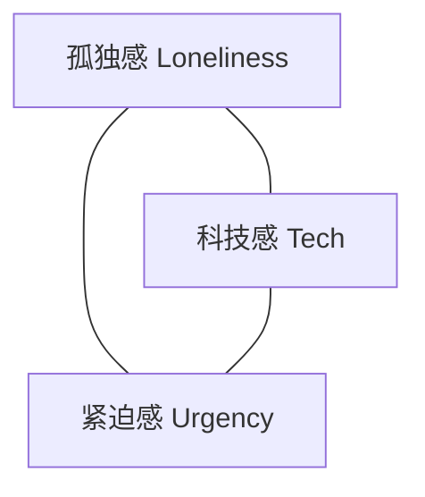

# 《火星信号》视觉与界面概念设计方案 v2.0

> **项目代号**：Mars Signal  
> **文档性质**：视觉与界面概念设计（不含代码实现）  
> **编制**：幻影-视觉技术专家  
> **日期**：2026-08-02  
> **修订说明**：v2.0 按全团统一文档标准修订，移除全部 ASCII 艺术，改用 Markdown 表格、结构化列表与 Mermaid 图表替代。

---

## 一、终端界面视觉风格

### 1.1 整体视觉基调

**关键词：复古工业科幻（Retro-Industrial Sci-Fi）**

灵感来源于 1970-80 年代 NASA 任务控制台、《异形》(1979) 飞船计算机 UI、CRT 磷光屏终端。核心定位是「100年后的工业级系统」——技术极度先进，但界面设计遵循**功能性至上、装饰极简**的太空工业原则。

| 视觉特征 | 说明 |
|---------|------|
| 暗色主导 | 屏幕 80% 以上面积为深黑/暗琥珀背景，仅文字与关键数据发光 |
| 磷光质感 | 文字带有微弱的辉光（glow）效果，模拟 CRT 显像管特性 |
| 扫描线纹理 | 全局叠加极淡的水平扫描线，营造老式显示器质感 |
| 信号噪点 | 通信时叠加随机字符噪点，信号越弱噪点越多 |

### 1.2 配色方案

采用**琥珀色（Amber Phosphor）**为主色调——既呼应火星沙尘的橙红色调，又区别于常见的绿色终端，形成独特视觉记忆。

| 色彩角色 | 色值（HEX） | RGB | 用途 |
|---------|------------|-----|------|
| 主背景 | `#0a0805` | 10, 8, 5 | 终端底色，极深棕黑 |
| 次背景 | `#15100a` | 21, 16, 10 | 面板/分区底色 |
| 主文字 | `#ffb347` | 255, 179, 71 | 琥珀色，正文与默认输出 |
| 高亮文字 | `#ffd699` | 255, 214, 153 | 选中/聚焦/重要信息 |
| 次要文字 | `#8b6914` | 139, 105, 20 | 注释/次要信息 |
| 警告色 | `#ff4444` | 255, 68, 68 | 危险/资源告急 |
| 注意色 | `#ffaa00` | 255, 170, 0 | 警告/资源偏低 |
| 安全色 | `#4a9d4a` | 74, 157, 74 | 正常状态/成功操作 |
| 信号色 | `#66ccff` | 102, 204, 255 | 信号/通信相关（冷色点缀，与暖色主调形成对比） |
| 边框线 | `#3d2b1f` | 61, 43, 31 | 面板分割线/边框 |

**配色逻辑**：暖色（琥珀/红/橙）为主调传递火星环境与紧张感；唯一的冷色（信号蓝）用于通信相关元素，暗示「来自远方的连接」，形成视觉温度的反差。

### 1.3 字体风格

| 用途 | 推荐字体 | 说明 |
|------|---------|------|
| 终端正文 | JetBrains Mono / Fira Code | 等宽字体，支持连字，科技感强 |
| 标题/系统标识 | Share Tech Mono | 略带棱角的等宽字体，用于系统标题 |
| 图标与符号 | Noto Sans Symbols 2 | 确保 Unicode 符号（方块、三角等）正确渲染 |
| 中文显示 | 思源等宽 / Sarasa Mono SC | 中英文等宽对齐 |

**字号规范**：

| 元素 | 字号 | 行高 |
|------|------|------|
| 正文 | 14px | 1.6 |
| 标题 | 18-20px | 1.4 |
| 状态栏 | 12px | 1.4 |
| 系统标识 | 20-24px | 1.2 |

**动态效果**：

| 效果 | 说明 |
|------|------|
| 光标闪烁 | 方块光标，频率 1Hz |
| 打字机输出 | 文字逐字输出，模拟信号传输延迟 |
| 信号干扰抖动 | 信号差时字符随机偏移 1-2px |

### 1.4 界面元素设计方向

| 元素类型 | 设计方式 | 说明 |
|---------|---------|------|
| 面板边框 | CSS 绘制细线边框 | 使用 1px solid `#3d2b1f`，而非 Unicode Box-Drawing 字符 |
| 图标 | Unicode 符号 + 颜色区分 | 使用 `◆ ▲ ● ○ ■ □ ▾` 等符号，搭配对应色彩 |
| 进度条 | CSS 渐变填充条 | 水平条状，填充色随状态变化（绿→橙→红） |
| 分隔线 | CSS `
` 或 1px 边框 | 替代字符分隔线 |
| 信号强度指示 | 四段式色块条 | 四格分段，从满到空用深→浅渐变表示 |
| 状态指示灯 | 圆形色点 | 绿(正常) / 橙(警告) / 红(危险) / 灰(离线) |

---

## 二、界面信息架构

### 2.1 整体布局概念

采用**分屏面板布局**，模拟多窗格终端。核心原则：**中央为主，两侧为辅，顶部状态，底部输入**。

| 区域 | 位置 | 占比（宽） | 高度 | 核心功能 |
|------|------|-----------|------|---------|
| 顶部状态栏 | 顶部通栏 | 100% | 1-2行 | 全局关键状态信息 |
| 左侧资源面板 | 左侧 | ~20% | 填满中段 | 基地资源实时监控 |
| 中央主终端 | 中部 | ~60% | 填满中段 | 通信对话、系统消息、探索内容 |
| 右侧成员面板 | 右侧 | ~20% | 填满中段 | NPC 状态显示 |
| 底部日志条 | 底部通栏 | 100% | 1-2行 | 系统事件流滚动 |
| 底部输入区 | 最底部 | 100% | 1行 | 玩家自然语言输入 |

### 2.2 各功能区详细设计

#### ① 顶部状态栏（Status Bar）

高度约 1-2 行，始终可见，显示全局关键状态。

| 元素 | 内容示例 | 说明 |
|------|---------|------|
| 信号强度 | 四段色块条 + 百分比（如 67%） | 玩家与基地的连接质量，影响通信可用性 |
| 时间 | `MSOL 14:23:07` | 火星太阳日时间（Sol 火星日 + 时分秒） |
| 警报状态 | 三级色点指示灯 | 绿(正常) / 橙(注意) / 红(紧急) |
| 连接路径 | `SAT-7 ↔ RELAY-3` | 当前信号经行的卫星与中继节点 |

#### ② 左侧资源监控面板（Resource Panel）

宽度约 18-20 字符，纵向排列基地关键资源。

| 资源项 | 显示内容 | 视觉规则 |
|--------|---------|---------|
| O₂ 氧气 | 百分比 + 进度条 + 预估续航 | <30% 变橙闪烁，<15% 变红闪烁 |
| PWR 电力 | 百分比 + 进度条 | <30% 变橙，<15% 变红 |
| H₂O 水源 | 百分比 + 循环系统状态 | <20% 变橙闪烁 |
| TEMP 温度 | 基地内/外温度（℃） | 异常范围显示红色 |
| FOOD 食物 | 百分比 + 剩余天数 | <25% 变橙 |

**预估续航汇总**（面板底部）：

| 资源 | 预估续航 | 状态 |
|------|---------|------|
| O₂ | 4天12小时 | ⚠ 注意 |
| PWR | 2天03小时 | ⚠ 注意 |
| H₂O | 6天18小时 | 正常 |

#### ③ 中央主终端区（Main Terminal）

占据最大面积，是核心交互区域。

| 功能子类 | 说明 |
|---------|------|
| 通信对话 | 显示与基地成员的自然语言对话 |
| 系统消息 | 信号建立、数据传输、系统事件 |
| 探索内容 | 查看日志文件、解码数据、查看地图等 |
| 信号效果 | 信号弱时消息出现乱码、缺字、重复 |

**消息格式规范**：

每条 NPC 消息包含以下结构化字段：

| 字段 | 示例 | 说明 |
|------|------|------|
| 时间戳 | `[14:21]` | 消息接收时间 |
| 发言者 | `Dr. 陈昊` | NPC 姓名与标识 |
| 正文 | 消息内容文本 | 支持多行 |
| 信号注释 | `[信号波动... 数据包重组 2/3]` | 可选，信号异常时插入 |
| 来源标识 | 颜色微调 | 不同 NPC 使用略有差异的暖色 |

#### ④ 右侧小组成员状态面板（Crew Status）

宽度约 18-20 字符，展示科研小组各成员实时状态。

每名成员显示以下信息：

| 显示项 | 说明 |
|--------|------|
| 角色标识符 | 角色专属符号 + 代表色（见第四节） |
| 姓名与职务 | 如 `Cmdr. 陈昊` |
| 通信状态 | 在线 / 活跃 / 静默 / 离线 / 未知 / 紧急 |
| 信号质量 | 独立四段色块条 + 百分比 |
| 情绪/健康 | 稳定 / 焦虑 / 受伤 等（可选） |

状态变化时有过渡动画（信号条渐变、状态文字闪烁）。

#### ⑤ 底部日志区（Log Strip）

高度 1-2 行的滚动条，显示系统级事件流。

| 事件格式 | 示例 |
|---------|------|
| 时间戳 + 事件摘要 | `[14:20] 信号握手成功` |
| 多事件串联 | `▸ [14:21] 接收消息 #0042 ▸ [14:22] 资源更新` |

- 自动滚动，最新事件在右侧
- 可点击展开查看完整日志

#### ⑥ 底部输入区（Input Area）

底部独立一行，玩家自然语言输入。

| 功能 | 说明 |
|------|------|
| 提示符 | `>` 符号闪烁 |
| 输入历史 | 上下键浏览 |
| 发送标识 | 消息出现在主终端区，带 `[YOU]` 标识 |

### 2.3 视图模式切换

终端支持 **Tab 切换** 不同主视图，左侧/右侧面板保持不变。

| 模式 | 快捷键 | 内容说明 |
|------|--------|---------|
| 通信视图（默认） | Tab+1 | 与基地成员对话 |
| 探索视图 | Tab+2 | 浏览文件系统、解码数据、查看基地日志 |
| 地图视图 | Tab+3 | 火星基地平面图 / 周边地形（CSS 网格渲染） |
| 信号视图 | Tab+4 | 卫星轨道追踪、中继节点管理 |

---

## 三、视觉氛围与情绪设计

### 3.1 核心情绪三角

三种核心情绪需动态平衡，随游戏状态切换主导情绪：

| 主导情绪 | 触发场景 | 设计目标 |
|---------|---------|---------|
| 科技感 | 探索数据、解码信息 | 让玩家专注、好奇 |
| 孤独感 | 通信中断、长时间无响应 | 传递距离感与孤立无援 |
| 紧迫感 | 资源告急、警报触发 | 驱动玩家快速决策 |

### 3.2 孤独感设计

| 手法 | 实现方式 |
|------|---------|
| 大面积黑暗 | 界面 80% 为暗背景，仅有少量文字发光 |
| 信息间隔 | NPC 回复有真实延迟（数秒~数十秒），期间屏幕近乎静止 |
| 静默状态 | 无信号时显示纯黑 + 闪烁光标 + 时间流逝计数 |
| 极简音画 | 无背景音乐，仅有微弱的电流底噪和偶发的信号杂音 |
| 距离感传达 | 对话中插入系统注释：`[传输延迟 4.2s]` `[信号来源: 225M km]` |

**关键场景**：玩家长时间无操作时，屏幕逐渐变暗，仅保留光标闪烁和顶部时间流逝——强化「一个人在远方」的孤独感。

### 3.3 紧迫感设计

| 手法 | 实现方式 |
|------|---------|
| 资源倒计时 | 左侧面板持续显示 `O₂ 4天12h` 倒计时，数字实时跳动 |
| 警报闪烁 | 危险资源条目闪烁 + 顶部警报灯变红 |
| 信号衰减 | 信号强度实时波动，关键时刻突然下降引发焦虑 |
| 时间压力 | 某些事件有「窗口期」，超时则后果发生 |
| 视觉压迫 | 警报触发时屏幕边缘出现红色脉冲晕染（CSS box-shadow 动画） |

### 3.4 科技感设计

| 手法 | 实现方式 |
|------|---------|
| 技术化措辞 | 系统消息使用术语：`载波解调` `数据包重组` `握手协议` |
| 数据可视化 | 信号波形图、卫星轨道参数、坐标数据（CSS/SVG 渲染） |
| 系统状态码 | Unix 风格状态输出：`[OK]` `[WARN]` `[ERR]` `[SIG-LOSS]` |
| 命令行交互 | 保留命令输入能力：`scan` `ping` `decode` 等 |
| 符号化美学 | 视觉元素以符号 + 色彩区分，克制装饰 |

### 3.5 动态氛围系统

界面氛围根据**游戏状态**动态变化：

| 游戏状态 | 背景色调 | 文字表现 | 特殊效果 |
|---------|---------|---------|---------|
| 正常通信 | 标准琥珀暗底 | 稳定辉光 | 无 |
| 信号微弱 | 标准琥珀暗底 | 偶发乱码、缺字 | 噪点增多，信号条闪烁 |
| 沙尘暴期间 | 偏红暗底 | 通信严重受阻 | 扫描线加重，红色色调 |
| 紧急警报 | 暗红底 | 警报区文字闪烁 | 边框红色脉冲，边缘晕染 |
| 深夜模式 | 更深暗底 | 辉光减弱 | 模拟节能模式 |
| 信号完全中断 | 纯黑 | 仅光标闪烁 | 时间流逝计数 + 底噪波形 |

### 3.6 声音设计概念（辅助视觉）

虽然是文字游戏，但建议加入极简音效以增强沉浸：

| 音效类型 | 触发时机 | 效果描述 |
|---------|---------|---------|
| 底噪 | 持续 | 微弱的电流嗡鸣 |
| 打字音 | 文字输出时 | 键盘敲击声 |
| 信号杂音 | 通信期间 | 白噪声/静电声 |
| 警报音 | 危急触发 | 低频蜂鸣 |
| 无信号静默 | 信号中断 | 完全静默（此时静默本身就是最强的声音） |

---

## 四、NPC 形象概念

### 4.1 呈现方式总则

**核心原则：不使用写实头像，NPC 形象以符号化标识 + 结构化文字描述呈现。**

| 理由 | 说明 |
|------|------|
| 风格统一 | 与终端整体符号化风格一致 |
| 隔阂感 | 符号化形象天然带有「远距离通信」的距离感 |
| 想象空间 | 激发玩家想象力，比写实图像更能营造叙事氛围 |

**三种呈现层次**：

| 层次 | 形式 | 用途 |
|------|------|------|
| 标识符 | 1-2 个符号 + 专属颜色 | 状态面板中的紧凑显示 |
| 角色卡片 | 结构化字段表格 | 对话时的角色信息展示 |
| 文字描述 | 风格化描述段落 | 首次接触/重要剧情节点 |

### 4.2 科研小组角色概念

科研小组共 **6 名**基地成员，每人有独特的视觉标识和性格。角色设定以蔚蓝《游戏系统设计方案 v1.1》为准。

#### 角色 1：任务指挥官 · 陈昊

| 属性 | 内容 |
|------|------|
| 职务 | 任务指挥官 / 行星地质学家（Commander） |
| 标识符号 | `◆`（实心菱形） |
| 代表色 | 深琥珀 `#ffb347` |
| 标签 | `[CMDR]` |
| 外观描述 | 42岁，中国籍，短发，面容坚毅，常年穿军用制式内舱服，左胸佩戴指挥官徽章。眼角有细纹，目光锐利但疲惫。 |
| 说话风格 | 沉稳果断，简洁权威，习惯压抑情绪。语句短促，常用祈使句。 |
| 说话示例 | "情况在恶化。我需要你优先修复中继。这是命令。" |
| 视觉特征 | 标识符使用实心菱形，角色卡片边框为双线样式，暗示军衔权威 |
| 剧情定位 | 玩家最主要的沟通对象，负责汇总小组意见、做最终决策。妻子在地球待产（Sol 120 左右预产期） |

#### 角色 2：生物化学家 · 索菲亚·拉米雷斯

| 属性 | 内容 |
|------|------|
| 职务 | 生物化学家 / 生命保障系统专家（Biochemist） |
| 标识符号 | `○`（空心圆） |
| 代表色 | 安全绿 `#4a9d4a` |
| 标签 | `[BIO]` |
| 外观描述 | 31岁，墨西哥/美国双籍，笑容明亮，穿实验服，指甲缝里总有泥土。随身携带便携培养皿。 |
| 说话风格 | 乐观开朗，黑色幽默，善于鼓舞士气，但有时轻率。 |
| 说话示例 | "好消息：水藻还在长。坏消息：它们长得比我们吃得快...等等，这是好消息吗？" |
| 视觉特征 | 标识符使用空心圆 + 绿色（生命/生物系），消息中常带氧气/农业数据标注 |
| 剧情定位 | 士气担当，生命保障系统关键执行者。隐瞒了对父亲去世的未处理悲伤 |

#### 角色 3：机械工程师 · 维克托·伊万诺夫

| 属性 | 内容 |
|------|------|
| 职务 | 机械工程师 / 设备维护与建造专家（Engineer） |
| 标识符号 | `▲`（实心三角） |
| 代表色 | 橙色 `#ffaa00` |
| 标签 | `[ENG]` |
| 外观描述 | 55岁，俄罗斯籍，壮实，灰白短发，手上总有油污。穿工装连体服，腰间别着工具带。面容沧桑但不怒自威。 |
| 说话风格 | 沉默寡言，务实干练，不信任 AI 决策，偶尔固执。常提及设备和技术细节。 |
| 说话示例 | "又跳闸了...这破发电机撑不了多久了。你那边能帮忙查一下太阳能板的输出参数吗？" |
| 视觉特征 | 标识符使用三角形 + 橙色（工业/机械系），消息中常出现设备参数表 |
| 剧情定位 | 关键技术执行者，与 AI 系统/玩家指令产生信任摩擦。曾参与月球基地建设，最后一次任务 |

#### 角色 4：通讯与 AI 系统工程师 · 艾莎·汗

| 属性 | 内容 |
|------|------|
| 职务 | 通讯与 AI 系统工程师（Communications & AI Engineer） |
| 标识符号 | `▾`（倒三角） |
| 代表色 | 冷蓝 `#66ccff` |
| 标签 | `[COMM]` |
| 外观描述 | 28岁，巴基斯坦/英国双籍，瘦削，戴耳麦，语速极快。穿通信岗位制服，面前总是一排频率监测屏。随身携带调校工具。 |
| 说话风格 | 好奇心旺盛，思维敏捷，语速快，过度依赖技术方案。精确到小数。 |
| 说话示例 | "信号源方位 247.3°。频率漂移 0.02Hz。建议切换至备用信道——雅典娜也同意这个判断。" |
| 视觉特征 | 标识符使用倒三角 + 冷蓝色（唯一的冷色调角色，暗示其负责「信号/AI」），消息格式如同电报，带信号参数头 |
| 剧情定位 | 技术接口人，玩家修复通信/解锁功能的主要协作者。负责维护基地 AI「雅典娜」 |

#### 角色 5：医疗官 · 马库斯·韦伯

| 属性 | 内容 |
|------|------|
| 职务 | 医疗官 / 心理评估员（Medical Officer） |
| 标识符号 | `✚`（十字医疗符） |
| 代表色 | 暖白 `#ffd699` |
| 标签 | `[MED]` |
| 外观描述 | 38岁，德国籍，温和理性，戴细框眼镜，穿医务内舱服，随身携带医疗包。观察力敏锐，表情克制。 |
| 说话风格 | 温和理性，善于倾听，观察力敏锐，理性到近乎冷漠。关注人的状态而非机器。 |
| 说话示例 | "大家的状况还行...但陈指挥已经两天没睡了。我担心的不只是氧气，还有他们的精神状态。" |
| 视觉特征 | 标识符使用十字符号 + 暖白色，消息中常出现队员健康/心理状态标注 |
| 剧情定位 | 小组心理健康监控者，最先暴露心理危机的人。隐瞒了自己的幽闭恐惧症恶化 |

#### 角色 6：大气物理学家 · 林若曦

| 属性 | 内容 |
|------|------|
| 职务 | 大气物理学家 / 气象观测员（Atmospheric Physicist） |
| 标识符号 | `◇`（空心菱形） |
| 代表色 | 暗琥珀 `#8b6914` |
| 标签 | `[ATM]` |
| 外观描述 | 26岁，中国籍，内向敏感，长发束起，穿监测站制服，常在角落默默记录数据。眼神中有种近乎预言式的恍惚感。 |
| 说话风格 | 内向敏感，直觉敏锐，有时有近乎预言式的感知力，社交退缩，话少但一语中的。 |
| 说话示例 | "...风暴的粒子密度不对。我说不上来，但数据在告诉我什么。三天前就该预警的。" |
| 视觉特征 | 标识符使用空心菱形 + 暗琥珀色（沉郁/神秘感），消息较短，偶有破碎语句 |
| 剧情定位 | 关键线索提供者，中期发现火星大气中的「异常信号」。最早察觉太阳风暴前兆却未能说服团队，深陷自责 |

### 4.3 基地 AI 系统视觉概念

除 6 名 NPC 外，基地存在两个有「人格」的 AI 系统，在终端中以特殊视觉风格呈现。

| AI 名称 | 定位 | 视觉标识 | 代表色 | 呈现方式 |
|---------|------|---------|--------|---------|
| 信使（Courier） | 玩家接入的通信中继 AI | `◈`（菱方） | `#66ccff` 冷蓝 | 系统消息风格，无情绪波动，消息前缀 `[COURIER]` |
| 雅典娜（Athena） | 基地 LLM 决策辅助系统 | `⬡`（六边形） | `#b399e6` 淡紫 | 数据分析风格，消息前缀 `[ATHENA]`，含数据标注 |

### 4.4 NPC 汇总表

| 角色 | 符号 | 代表色 | 标签 | 说话风格 | 剧情定位 |
|------|------|--------|------|---------|---------|
| 陈昊 | ◆ | `#ffb347` 深琥珀 | CMDR | 沉稳果断 | 基地指挥，决策核心 |
| 索菲亚 | ○ | `#4a9d4a` 安全绿 | BIO | 乐观幽默 | 生命保障，士气担当 |
| 维克托 | ▲ | `#ffaa00` 橙色 | ENG | 沉默务实 | 设备维护，技术执行 |
| 艾莎 | ▾ | `#66ccff` 冷蓝 | COMM | 敏捷精确 | 通信/AI，技术接口 |
| 马库斯 | ✚ | `#ffd699` 暖白 | MED | 温和理性 | 医疗健康，心理监控 |
| 林若曦 | ◇ | `#8b6914` 暗琥珀 | ATM | 内向敏感 | 关键线索，核心悬念 |

### 4.5 NPC 状态系统

每名 NPC 在右侧状态面板中的显示字段：

| 显示项 | 内容示例 | 说明 |
|--------|---------|------|
| 标识符 + 姓名 | `◆ Cmdr. 陈昊` | 符号 + 颜色 + 姓名 |
| 通信状态 | `在线` / `活跃` / `静默` / `离线` / `未知` / `紧急` | 带状态色点 |
| 信号质量 | 四段色块条 + 百分比 | 独立信号强度 |
| 情绪/健康 | `稳定` / `焦虑` / `受伤` 等 | 可选显示 |

**通信状态定义**：

| 状态 | 色点 | 含义 |
|------|------|------|
| 在线 | 绿 | 正常可通信 |
| 活跃 | 绿 | 在线且正在发送消息 |
| 静默 | 橙 | 有连接但无响应（忙碌/受伤/不愿回应） |
| 离线 | 灰 | 无连接 |
| 未知 | 灰闪烁 | 信号无法确认状态（最令人不安） |
| 紧急 | 红闪烁 | 发送了求救信号 |

**信号质量对消息完整度的影响**：

| 信号质量 | 消息表现 | 示例 |
|---------|---------|------|
| 80-100% | 完整清晰 | 正常显示 |
| 50-79% | 偶发缺字 | 个别字符替换为 `▓` |
| 20-49% | 频繁乱码 | 多处字符替换为 `▒▓`，句子断裂 |
| 0-19% | 几乎不可读 | 大面积乱码，仅偶有可辨识片段 |

**受保护内容规则**：

信号缺失遮罩不能纯随机，关键剧情信息需受保护，仅环境描写、闲聊等非关键内容可被遮罩。

| 内容类型 | 是否受保护 | 说明 |
|---------|-----------|------|
| NPC 姓名 | 是 | 始终可读，确保玩家辨识发言者 |
| 指令响应/任务关键内容 | 是 | 确保游戏可玩性不受信号干扰 |
| 数值数据（资源、坐标等） | 是 | 关键决策依据必须可读 |
| 环境描写/氛围文字 | 否 | 可被遮罩，增强信号干扰感 |
| 闲聊/情感表达 | 否 | 可被遮罩，不影响核心玩法 |
| 系统消息/警报 | 是 | 安全相关信息必须传达 |

**实现方式**：后端在消息文本中标记「受保护」片段（如使用标记标签），前端仅对未标记部分按四档信号质量规则执行字符遮罩。

---

## 五、关键界面状态概念

### 5.1 游戏启动界面

启动界面显示以下元素，居中排列于纯黑背景上：

| 元素 | 位置 | 内容 | 样式 |
|------|------|------|------|
| 游戏标题 | 居中偏上 | `MARS SIGNAL` / `火星信号` | 大字号琥珀色，字间距加宽 |
| 副标题 | 标题下方 | `─── 火星信号 ───` | 细线分隔 |
| 状态提示 | 中部 | `[ 信号搜索中... ]` | 闪烁文字 |
| 进度条 | 中部下方 | 四段色块扫描动画 | 从左到右逐步填充 |
| 频率信息 | 进度条下 | `扫描频率范围: 1.4 - 1.7 GHz` | 次要文字色 |
| 操作提示 | 底部 | `> 按 ENTER 建立连接` | 闪烁光标 |

### 5.2 信号完全中断状态

全屏黑暗，仅显示极少信息，居中排列：

| 元素 | 内容 | 样式 |
|------|------|------|
| 状态标题 | `[ 无信号 ]` | 红色，居中 |
| 丢失时间 | `信号丢失于 MSOL 14:23:07` | 次要文字色 |
| 已过时间 | `已过: 00:04:32` | 主文字色，实时跳动 |
| 光标 | `_` | 闪烁 |

这是游戏中最孤独的时刻——全屏几乎纯黑，只有时间在流逝。

### 5.3 警报状态

| 区域 | 变化 |
|------|------|
| 顶部状态栏 | 警报灯变红，显示 `[!] 紧急警报: 氧气储量低于 15% [!]` |
| 资源面板 | 全部条目变红闪烁 |
| 边框 | 整体边框变为红色脉冲动画 |
| 背景 | 屏幕边缘出现红色晕染（box-shadow 红色脉冲） |

---

## 六、视觉资源清单

### 6.1 需要生成的视觉素材

| 编号 | 素材名称 | 格式 | 说明 |
|------|---------|------|------|
| V01 | 游戏标题 Logo | SVG / CSS 排版 | 启动界面标题，文字 + 样式实现 |
| V02 | 6 个 NPC 角色卡片 + 2 个 AI 系统卡片 | Markdown 表格 / 结构化数据 | 角色信息展示模板 |
| V03 | 火星基地平面图 | CSS Grid 网格 | 地图视图，网格化平面布局 |
| V04 | 卫星轨道示意图 | SVG 简笔图 | 信号视图，轨道与节点关系 |
| V05 | 信号波形图模板 | SVG / CSS 动画 | 动态信号波形 |
| V06 | UI 边框与装饰元素 | CSS 样式表 | 面板边框、分隔线样式 |
| V07 | 状态图标集 | Unicode 符号 + 色值表 | 资源、警报、信号等状态图标 |
| V08 | 加载/扫描动画 | CSS 动画 | 信号搜索、数据传输进度动画 |

### 6.2 配色规范文件

需输出标准化的色彩规范，供前端/引擎实现时直接引用：

| 输出内容 | 格式 | 说明 |
|---------|------|------|
| HEX 色值表 | CSS 变量定义 | 见 1.2 节配色方案 |
| 状态色组合 | CSS 类名 | 正常/警告/危险/离线 四套配色 |
| 角色专属色 | CSS 变量 | 6 名 NPC + 2 个 AI 系统的代表色 |

---

## 七、设计原则总结

| 原则 | 说明 |
|------|------|
| **符号至上** | 视觉元素以符号 + 色彩表达，不使用位图或写实图像，确保终端一致性 |
| **暗色主导** | 界面以黑暗为底，仅关键信息发光，强化孤独与聚焦 |
| **暖冷分明** | 主调暖色（火星/人），点缀冷色（信号/远方） |
| **动态氛围** | 界面氛围随游戏状态变化，非静态 |
| **留白即叙事** | 无信号时的黑暗和静默本身就是叙事手段 |
| **克制装饰** | 每一个视觉元素都应服务于功能或情绪，拒绝纯装饰 |

---

> **下一步**：本方案为概念设计阶段，待世界观与剧情框架确认后，可进入具体素材制作与前端实现规范输出阶段。如需调整风格方向或补充细节，请随时反馈。
