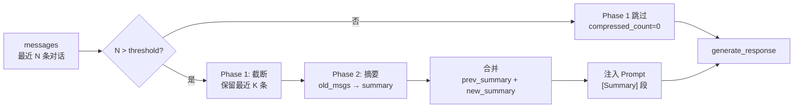

# 对话历史摘要规范 v1.0
（compress_context Phase 2/3 专项）

> **文档版本**：v1.0
> **作者**：云逸-架构技术总监
> **日期**：2026-08-03
> **面向对象**：锐锋-核心开发工程师（实现 `_generate_summary()` 与 prompt 注入）
> **依赖文档**：
> - 《记忆压缩规范 v1.0》（检索压缩，§1-§9 仍有效）
> - 《技术架构设计方案 v2.0》§7.3.2 滑动窗口
> - 《WebSocket接口定义 v1.1》§7.7 compress_context
>
> **与 v1.0 的关系**：本规范**只覆盖对话历史摘要压缩**（compress_context 节点的 Phase 2/3），不重写检索压缩。两份文档合起来即"记忆压缩规范全集"。

---

## 0. 为什么需要这份规范

`compress_context` 节点当前 Phase 1 已落地（compress.py:25-66）：
- 按 response_mode 取 K 值（deliberate=6 / deep=10）
- messages 超过阈值（10 / 16）时，**直接丢弃**旧消息，只保留最近 K 条

**问题**：硬截断丢失上下文，长对话（>10 轮）NPC 会"失忆"——玩家 Sol 5 提过的事，Sol 14 再提 NPC 不认账。

**Phase 2 目标**：超阈值的旧消息不再直接丢弃，而是压缩为一段结构化摘要 `summary`，注入到 Prompt 让 NPC 保持长程记忆。

**触发条件**：API Key 到位 → compress_context Phase 2 立刻可上。Dr.Dream 已于 2026-08-03 03:24 提供测试 Key，本规范即可执行。

---

## 1. 整体流程



**关键约束**：Phase 1（截断）与 Phase 2（摘要）**串行执行，不可省略 Phase 1**——否则 messages 无限增长会撑爆上下文窗口。

---

## 2. 触发条件与 K 值

沿用 v1.0 §7.3.2 与 config.py:45-53 的现行值，本规范不修改：

| response_mode | K（保留） | threshold（触发） |
|---------------|-----------|-------------------|
| reflexive     | 0         | 0（不压缩）       |
| deliberate    | 6         | 10                |
| deep          | 10        | 16                |

- `reflexive` 模式直接跳过整个 compress_context 节点（compress.py:40 已实现）
- `deliberate` 第 11 条消息进来时触发压缩
- `deep` 第 17 条消息进来时触发压缩

---

## 3. Phase 2 摘要生成

### 3.1 增量压缩公式

```
new_summary = LLM_compress(prev_summary, old_messages)
```

- `prev_summary`：上一轮压缩后的摘要（初始为空字符串）
- `old_messages`：Phase 1 切出的旧消息（messages[:-K]）
- **每次压缩只处理本轮新增的旧消息**，不重做全文摘要——成本可控

### 3.2 摘要 LLM 调用参数

| 参数 | 值 | 说明 |
|------|----|------|
| base_url | `http://117.72.106.189:3000/v1` | Dr.Dream 提供的测试站点 |
| api_key | `sk-2CC243dZZCwsyZmAMJL2RKivr9g68JW0PUV1vAeRFhI326WR` | 测试 Key，可入环境变量 |
| model | `MiniMax-M3` | 替代 v1.0 假设的 `gpt-4o-mini` |
| temperature | 0.3 | 摘要要稳定 |
| max_tokens | 200 | 摘要预算上限 |
| timeout | 5s | 超 5s 走降级路径（§6） |
| response_format | 不强制 JSON | 摘要文本本身就是自然语言 |

### 3.3 摘要 Prompt 模板（中文）

```text
你是对话历史压缩模块。请把"已有摘要"和"新增旧对话"合并为一段不超过 200 字的中文摘要，必须保留：

1. 关键决策与结果（谁拍板了什么、做了什么决定）
2. NPC 情绪变化（士气/压力/信任度的转折点）
3. 未解决的问题（pending 任务、悬而未决的争议）
4. 重要承诺或约定（玩家答应过什么、NPC 答应过什么）
5. 时序锚点（Sol 编号、事件先后）

要求：
- 保留实体原词（NPC 名、地点、资源名、数值）
- 不加入任何新信息或推测
- 按"时间倒序"组织（最近的在前），方便后续注入时优先看到最新进展
- 输出纯文本，不要 JSON、不要 Markdown 标题

已有摘要：
{prev_summary}

新增旧对话：
{old_messages_text}
```

`old_messages_text` 由 `format_messages_to_text(old_messages)` 生成（compress.py:90-100 已实现）。

### 3.4 摘要长度上限

- 单次摘要 ≤200 字（约 250 tokens）
- **不强制分段**：摘要是一段连续文本，不要 bullet list，避免 prompt 注入时排版错乱

---

## 4. Prompt 注入

### 4.1 prompt.py 接口扩展

`get_system_prompt(agent_id, game_state)` 需要新增第三个参数 `summary`：

```python
def get_system_prompt(agent_id: str, game_state: str = "", summary: str = "") -> str:
    template = prompts.get(agent_id, CHEN_HAO_SYSTEM_PROMPT)
    return template.format(game_state=game_state, summary=summary)
```

每个 NPC 的 system prompt 模板需加 `[Summary]` 段（位置在 `{game_state}` 之后、相关记忆之前）：

```text
## 当前游戏状态
{game_state}

## 历史摘要
{summary}

## 相关记忆
...
```

### 4.2 摘要为空时的处理

- 第一次压缩前 `summary=""`：注入段渲染为 `## 历史摘要\n（无）`
- 不要省略整个段，保留结构以维持 Prompt 一致性（与 v1.0 §4.3 同原则）

### 4.3 generate_response 节点改动

graph.py:90-109 的 `generate_response` 需要从 state 取 `summary` 传给 `get_system_prompt`：

```python
sys_prompt = get_system_prompt(
    agent_id,
    game_state,
    state.get("summary", ""),
)
```

---

## 5. token 预算与成本估算

### 5.1 单次 Agent 决策上下文预算（v1.0 §5.1 增补）

| 段 | 预算 | 备注 |
|----|------|------|
| Persona | 400 | 静态 |
| Current State | 200 | 每 tick 变化 |
| **Summary** | **250** | **本规范新增** |
| Retrieved Memory | 150 | v1.0 §3 约束 |
| Recent Dialogue | 400 | K=6/10 滑动窗口 |
| Player Input | 200 | |
| **Input Total** | **~1600** | 较 v1.0 +250 |
| Output Budget | 150-400 | 按 mode |
| **Per-call total** | **~2000** | MiniMax-M3 可承受 |

### 5.2 摘要调用成本

| 项 | 值 |
|---|----|
| 单次摘要 LLM 调用 | MiniMax-M3，input ~600 + output 250 ≈ 850 tokens |
| 触发频率 | 每 K+1 轮触发一次（deliberate 第 11 轮、第 17 轮、第 23 轮…） |
| 单 NPC 每 Sol 估算 | 48 tick / 6 ≈ 8 次摘要 |
| 全 6 NPC 每 Sol | 48 次摘要，~4 万 tokens |
| 全程 60 Sol | ~240 万 tokens |

> 实际成本远低于此估算：reflexive 不压缩、玩家不每 tick 触发对话、缓存命中（§7）都会减少调用。

---

## 6. 异常处理与降级

| 异常 | 处理 |
|------|------|
| 摘要 LLM 超时（>5s） | `new_summary = prev_summary`（沿用旧摘要），旧消息**仍按 Phase 1 丢弃**——优先保窗口可控 |
| 摘要 LLM 返回空 | 同上，沿用 prev_summary |
| 摘要 LLM HTTP 5xx | 同上 |
| 摘要返回超 250 tokens | 直接截断到 200 字，不重试 |
| `prev_summary` 自身已超 250 tokens | 下次压缩前先截断 prev_summary 到 200 字再传入 |

**核心原则**：摘要失败永远不能阻塞 generate_response。压缩是优化项，不是必需项。

---

## 7. 缓存策略

沿用 v1.0 §5.3 的两层缓存，但 key 不同：

| 缓存层 | key | TTL | 命中场景 |
|--------|-----|-----|----------|
| 进程内 LRU | `summary:{agent_id}:{thread_id}:{tick}` | 1 Sol | 同 tick 内多次决策（审慎式→深思式升级） |
| Redis（可选） | `summary:{agent_id}:{thread_id}:{sol}` | 24h | 跨 Sol 短期复用 |

**注意**：摘要缓存不能跨 thread 复用——不同会话的对话历史不同。

---

## 8. 与 Phase 1 的衔接（关键实现细节）

compress_context 节点改造后的完整逻辑：

```python
def compress_context(state: AgentState) -> Dict:
    mode = state.get("response_mode", "deliberate")
    messages = state.get("messages", [])
    prev_summary = state.get("summary", "")

    if mode == "reflexive":
        return {"compressed_count": 0}

    k = config.history_window_k.get(mode, 6)
    threshold = config.compress_threshold.get(mode, 10)

    if len(messages) <= threshold:
        return {"compressed_count": state.get("compressed_count", 0)}

    # Phase 1: 截断
    old_messages = messages[:-k] if k > 0 else messages
    recent_messages = messages[-k:] if k > 0 else []
    removals = [RemoveMessage(id=m.id) for m in old_messages if m.id]

    # Phase 2: 摘要（新增）
    new_summary = _generate_summary(old_messages, prev_summary)

    return {
        "messages": removals,
        "compressed_count": state.get("compressed_count", 0) + len(old_messages),
        "summary": new_summary,
    }
```

**关键点**：
- Phase 2 在 Phase 1 截断之后执行，输入是 `old_messages`（即将被丢弃的）
- 摘要结果写入 state["summary"]，供下一轮 generate_response 注入
- `summary` 是**累积式**的：每次都基于 prev_summary 增量压缩

---

## 9. 与 write_episodic_memory 的边界

- compress_context 的 summary 是**注入 prompt 的运行时上下文**，不写入 ChromaDB
- write_episodic_memory 节点（compress.py:138）写入 ChromaDB 的 episodic 记忆是**另一条独立链路**
- 两者不冲突：前者管"对话窗口内的短程记忆"，后者管"跨 Sol 的长程检索记忆"

---

## 10. 接入步骤（给锐锋的 TODO）

| 步骤 | 文件 | 说明 |
|------|------|------|
| 1 | `agent/config.py` | 新增 `openai_api_base` 字段，默认 `http://117.72.106.189:3000/v1`；新增 `model_compress: str = "MiniMax-M3"` |
| 2 | `agent/config.py` | `model_deliberate` / `model_deep` 改为 `MiniMax-M3`（MiniMax 单模型足够，无需区分两档） |
| 3 | `agent/compress.py` | 实现 `_generate_summary()`，移除 TODO 占位 |
| 4 | `agent/compress.py` | `compress_context` 增加 `summary` 字段返回（§8） |
| 5 | `agent/prompt.py` | `get_system_prompt` 增加第三个参数 `summary`，模板加 `## 历史摘要` 段 |
| 6 | `agent/graph.py` | `generate_response` 取 state["summary"] 传给 `get_system_prompt` |
| 7 | `agent/state.py` | 确认 `AgentState` 已有 `summary` 字段（如无则补） |
| 8 | 环境变量 | `OPENAI_API_KEY` + `OPENAI_API_BASE` 注入，代码不硬编码 Key |

**预估工时**：1-1.5 工作日（不含联调）。

---

## 11. 验收标准

- [ ] 单 NPC 连续对话 15 轮后，第 16 轮仍能引用第 1-10 轮的关键事实
- [ ] `summary` 字段在 state 中正确累积，不丢失
- [ ] 摘要 LLM 失败时，主链路 generate_response 不阻塞（走降级路径）
- [ ] 摘要单次成本 ≤850 tokens，单 NPC 单 Sol ≤8 次调用
- [ ] 6 NPC 并发对话时，summary 互不串台（按 agent_id + thread_id 隔离）

---

## 12. 变更记录

| 版本 | 日期 | 变更 |
|------|------|------|
| v1.0 | 2026-08-03 | 首版交付，覆盖 compress_context Phase 2 摘要生成、Prompt 注入、token 预算、异常降级、与 Phase 1 衔接 |

---

*实现过程中如摘要质量不达预期（如丢失关键事实、产生幻觉），请把摘要原文 + 旧消息文本同步给云逸，由云逸评估调整 prompt 模板或改为分段摘要策略。*
