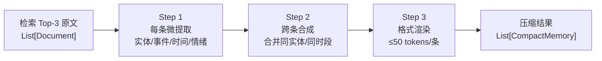

# 记忆压缩规范 v1.0

> **文档版本**：v1.0  
> **作者**：云逸-架构技术总监  
> **日期**：2026-08-02  
> **面向对象**：锐锋-核心开发工程师（链路实现）、幻影-视觉技术专家（仅参考）、蔚蓝-游戏系统策划（仅参考）  
> **依赖文档**：《技术架构设计方案 v2.0》§1.2 记忆层、§5.3 向量记忆方案

---

## 0. 设计目标

| 目标 | 说明 |
|------|------|
| **控成本** | 检索 Top-3 原文 300-1500 tokens → 压缩为 ≤150 tokens 注入 Prompt |
| **保留关键** | 不丢实体（NPC 名/地点/资源名/数值）、时序、情绪强度 |
| **零侵入** | LLM 不感知压缩过程，输出格式对 Prompt 工程透明 |
| **可降级** | 压缩 LLM 超时/失败时回退到原文前 50 字符，不阻塞决策 |
| **可缓存** | 同一组检索结果在短窗口内复用压缩输出，避免重复调用 |

---

## 1. 输入契约

### 1.1 上游输入

LangChain retriever 调用：

```python
docs: List[Document] = memory_retriever.invoke(query, k=3)
```

### 1.2 单条 Document 结构

| 字段 | 类型 | 说明 |
|------|------|------|
| `page_content` | str | 原始记忆文本，长度 100-500 tokens |
| `metadata.agent_id` | str | 记忆归属 Agent |
| `metadata.memory_type` | enum | `episodic` / `semantic` / `relationship` |
| `metadata.sol` | int | 游戏内火星日 |
| `metadata.tick` | int | 记忆写入时的 game tick |
| `metadata.emotional_intensity` | float | 0-1 |
| `metadata.event_type` | enum | `crisis` / `discovery` / `routine` / `character` |
| `metadata.importance` | float | 0-1，由写入时打分 |

---

## 2. 压缩流水线

### 2.1 三步流程



### 2.2 Step 1：单条微提取（per-doc）

每条 Document 单独调用一次压缩 LLM，输出结构化 JSON。

**System Prompt 模板**（固定，不参与 Agent 人格）：

```text
You are a memory compression module. Extract from the source text:
- entities: list of NPC names, locations, resources, mission keywords (preserve exact strings)
- action_summary: one sentence describing what happened (subject + verb + object, ≤20 words)
- time_ref: sol number if mentioned, else null
- emotional_tag: one word from {calm, tense, hopeful, despair, fear, anger, joy}
- importance_score: 0-1, based on emotional_intensity + stakes

Output strict JSON, no commentary.
```

**用户消息**：`page_content` + metadata 摘要（仅传 `sol`, `event_type`, `emotional_intensity`）

**调用参数**：

| 参数 | 值 |
|------|-----|
| model | `gpt-4o-mini` |
| temperature | 0.3 |
| max_tokens | 80 |
| response_format | `json_object` |
| timeout | 3s |

### 2.3 Step 2：跨条合成

合并规则（在 Python 中完成，不再调 LLM）：

| 合并条件 | 处理 |
|---------|------|
| 同一实体名出现在多条 | 保留首次出现的实体段，后续条目只在 `related_entities` 中引用 |
| 同一 `time_ref`（同 sol） | 合并为同一时间块，但保留各自 action_summary |
| `importance_score < 0.3` | 直接丢弃（不参与合成） |
| 三条相互独立 | 不合并，各自输出 |

### 2.4 Step 3：格式渲染

每条压缩后渲染为单行字符串：

```
[Sol{time_ref} · {emotional_tag}] {action_summary} | entities: {e1}, {e2}
```

示例：

```
[Sol14 · tense] 陈昊否决了维克托的外出采样请求，担心沙尘暴 | entities: 陈昊, 维克托, 气闸舱
[Sol14 · fear] 走廊3号气密门异常关闭，氧气消耗率上升8% | entities: 走廊3号, 气密门, 氧气
[Sol13 · hopeful] 林若曦报告外部温度回升，地表勘探窗口出现 | entities: 林若曦, 地表温度
```

---

## 3. 输出格式

### 3.1 CompactMemory 结构

```json
{
  "compact_text": "[Sol14 · tense] 陈昊否决了维克托的外出采样请求... | entities: 陈昊, 维克托, 气闸舱",
  "entities": ["陈昊", "维克托", "气闸舱"],
  "time_ref": 14,
  "emotional_tag": "tense",
  "token_count": 38,
  "source_doc_ids": ["mem_abc", "mem_def"]
}
```

### 3.2 整批输出（注入 Prompt 用）

```text
[Retrieved Memory]
• [Sol14 · tense] 陈昊否决了维克托的外出采样请求，担心沙尘暴 | entities: 陈昊, 维克托, 气闸舱
• [Sol14 · fear] 走廊3号气密门异常关闭，氧气消耗率上升8% | entities: 走廊3号, 气密门, 氧气
• [Sol13 · hopeful] 林若曦报告外部温度回升，地表勘探窗口出现 | entities: 林若曦, 地表温度
```

- 三条总计 ≤150 tokens
- 单条 ≤50 tokens，超出截断并保留 entities 列表

---

## 4. Prompt 注入

### 4.1 Agent System Prompt 结构

```text
[Persona]
{完整人格画像，约 400 tokens}

[Current State]
Sol: 14 | 时段: 夜 | 所在: 指挥舱
情绪: stress=0.55, morale=0.50
体力: 0.72
当前任务: 评估外出风险

[Retrieved Memory]
{压缩后的三条记忆，见 §3.2}

[Recent Dialogue]
{近 5 轮对话滑动窗口，约 400 tokens}

[Player Input]
{玩家原始消息，≤200 tokens}
```

### 4.2 占位符与注入点

- 占位符：`{{RETRIEVED_MEMORY}}`，由 LangChain PromptTemplate 渲染替换
- 注入位置：在 `[Current State]` 之后、`[Recent Dialogue]` 之前——让记忆作为"上下文背景"而非"指令"
- 不在记忆段加任何"请基于这些记忆回答"的指引——避免 LLM 把检索段当指令执行

### 4.3 检索为空时

```text
[Retrieved Memory]
• 无相关记忆
```

不要省略整个段，保留结构以维持 Prompt 一致性。

---

## 5. token 预算与成本估算

### 5.1 单次 Agent 决策上下文预算

| 段 | 预算 | 备注 |
|----|------|------|
| Persona | 400 | 静态，可缓存 |
| Current State | 200 | 每 tick 变化 |
| Retrieved Memory | 150 | 本规范约束上限 |
| Recent Dialogue | 400 | 滑动窗口裁剪 |
| Player Input | 200 | 玩家原始消息 |
| **Input Total** | **~1350** | |
| Output Budget | 150 | 日常 ≤80，紧急 ≤150 |
| **Per-call total** | **~1500** | GPT-4o 约 $0.005 |

### 5.2 压缩调用成本

| 项 | 值 |
|---|----|
| 单次压缩 LLM 调用 | gpt-4o-mini，input ~200 + output 80 = $0.0001 |
| 每 Agent 决策调压缩次数 | 3（每条原文一次） |
| 单次决策压缩成本 | $0.0003 |
| 每 Sol 6 Agent × 5 决策/tick × 48 tick | 1440 次压缩 = $0.43/Sol |
| 全程 60 Sol | ~$26 |

> 实际成本会低于此估算，因为：(a) 反射式决策不调压缩；(b) 缓存命中减少调用。

### 5.3 缓存策略

| 缓存层 | key | TTL | 命中场景 |
|--------|-----|-----|----------|
| 进程内 LRU | `hash(doc_ids)` | 5min | Agent 短时间内重新决策（如审慎式 → 深思式升级） |
| Redis | `compress:{hash}` | 5min | 跨 Agent 同上下文检索（如团队会议中多人查同一关键词） |

---

## 6. 异常处理

| 异常 | 处理 |
|------|------|
| 压缩 LLM 超时（>3s） | 用原文 `page_content[:50]` 作为 compact_text，仍注入 |
| 压缩 LLM 返回非法 JSON | 解析失败 → 降级用原文前 50 字符 |
| 压缩 LLM HTTP 5xx | 跳过该条，最终压缩结果可能为空 → 注入"无相关记忆" |
| 检索 Top-3 全部 importance < 0.3 | 全部丢弃 → 注入"无相关记忆" |
| 三条合并后超 150 tokens | 按重要性排序，保留前 N 条直至达到预算 |

---

## 7. 与 WebSocket 协议的解耦

记忆压缩是**纯后端内部流程**，不与 WebSocket 消息直接绑定：

- 压缩发生在 Agent.decide() 内部，发生在 segments 后处理**之前**
- 压缩结果注入 Agent Prompt → Agent LLM 产出自然文本 → 后处理切片 → segments → WebSocket agent_message
- 前端零感知：segments 中不会出现压缩记忆原文，只看到 Agent 最终对白

---

## 8. 待办与下一步

| 待办 | 责任方 | 备注 |
|------|--------|------|
| 实现 MemoryCompressor 模块 | 锐锋 | 含三步流水线 + 缓存 |
| 调用三档延迟评估 | 锐锋 | 在原型链路里同步跑压缩，测 P50/P95 延迟 |
| 调整检索 Top-K 与压缩预算 | 云逸 | 原型数据出来后评估是否放宽到 Top-5 |
| importance 打分策略 | 蔚蓝 + 云逸 | 事件触发时由事件系统给定初始分，Agent 反思时上调 |
| 跨库迁移测试（Qdrant） | 锐锋 | metadata schema 已对齐 Qdrant payload，迁移逻辑不动 |

---

## 9. 变更记录

| 版本 | 日期 | 变更 |
|------|------|------|
| v1.0 | 2026-08-02 | 首版交付，覆盖输入契约、三步压缩流水线、Prompt 注入、token 预算、缓存策略、异常降级 |

---

*实现过程中如压缩质量不达预期，请同步延迟与 token 数据，由云逸评估调整 prompt 模板或 K 值。*
